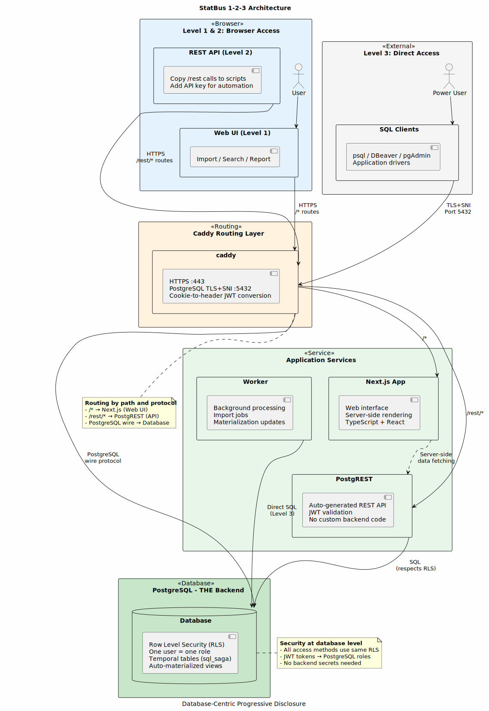

# STATBUS

**STATistical BUSiness Registry** - A temporal database system for tracking business activity throughout history.

Developed by [Statistics Norway (SSB)](https://www.ssb.no/) | Website: https://www.statbus.org/

---

## Quick Navigation

**Choose your path based on your role:**

### 📊 I want to **use** StatBus
→ **[User Guide (doc/USAGE.md)](doc/USAGE.md)**
- Load and manage business registry data
- Access data via web interface or api
- Generate reports and export data

**→ Ready to integrate?** See **[Integration Guide (doc/INTEGRATE.md)](doc/INTEGRATE.md)** for REST API and PostgreSQL access

### 🚀 I want to **deploy** StatBus
→ **[Deployment Guide (doc/DEPLOYMENT.md)](doc/DEPLOYMENT.md)** - Single instance deployment (one country)  
→ **[Cloud Guide (doc/CLOUD.md)](doc/CLOUD.md)** - Multi-tenant cloud deployment (for SSB staff)

### 💻 I want to **develop** StatBus
→ **[Development Guide (doc/DEVELOPMENT.md)](doc/DEVELOPMENT.md)**
- Set up local development environment
- Understand the codebase and architecture
- Contribute to the project

---

## What is StatBus?

StatBus is a statistical business registry that helps track business activity throughout history using temporal tables. It allows you to query the state of business units at any point in time.

### Our Motto

*Simple to Use, Simple to Understand, Simply Useful*

### Key Features

- **Temporal Data**: Track changes over time with valid_from/valid_to timestamps
- **Row Level Security**: Integrated security at the database level
- **REST API**: Automatic API generation from database schema via PostgREST
- **Direct PostgreSQL Access**: Secure TLS-encrypted connections for SQL tools
- **Modern Web Interface**: Built with Next.js and TypeScript
- **Multi-tenant Ready**: SNI-based routing for hosting multiple instances

---

## Technology Stack

### Backend

- **[PostgreSQL 18+](https://www.postgresql.org)** - Database with temporal tables
  - Row Level Security for access control
  - [SQL Saga](https://github.com/veridit/sql_saga) for temporal foreign keys
  - Custom JWT authentication integrated with PostgREST
  
- **[PostgREST 12+](https://postgrest.org/)** - Automatic REST API from database schema
  
- **[Caddy](https://caddyserver.com)** - Web server and reverse proxy
  - Automatic HTTPS with Let's Encrypt
  - Layer4 TLS proxy for PostgreSQL with SNI routing
  - Cookie-to-header JWT conversion

### Frontend

- **[Next.js 15+](https://nextjs.org)** - React framework with App Router
- **[TypeScript](https://www.typescriptlang.org)** - Type-safe JavaScript
- **[Tailwind CSS](https://tailwindcss.com)** - Utility-first CSS framework
- **[shadcn/ui](https://ui.shadcn.com)** - Component library
- **[Highcharts](https://www.highcharts.com)** - Data visualization
- **[Jotai](https://jotai.org)** - Atomic state management

### Infrastructure

- **[Docker](https://www.docker.com)** - Container runtime
- **[Docker Compose](https://docs.docker.com/compose/)** - Multi-container orchestration
- **[Crystal](https://crystal-lang.org)** - CLI tool and background worker

---

## Quick Start

### For Users

1. Get access to a StatBus instance from your administrator
2. Log in via web browser
3. Start loading data or querying via REST API or PostgreSQL
4. Sample csv files available for each step from the GUI

See **[User Guide](doc/USAGE.md)** for detailed instructions.

### For Administrators (Single Instance Deployment)

```bash
curl -fsSL https://statbus.org/install.sh | bash
```

For a specific version (pre-release or pinned):
```bash
curl -fsSL https://statbus.org/install.sh | bash -s -- --version v2026.03.0-rc.25
```

This downloads the `sb` CLI and bootstraps the full environment. Follow the on-screen prompts to configure your deployment.

See **[Deployment Guide](doc/DEPLOYMENT.md)** for detailed instructions.

### For Developers (Local Development)

```bash
# Clone repository
git clone https://github.com/statisticsnorway/statbus.git
cd statbus

# Configure git hooks
git config core.hooksPath devops/githooks

# Generate configuration
./devops/manage-statbus.sh generate-config

# Start backend services
./devops/manage-statbus.sh start all_except_app

# Initialize database
./devops/manage-statbus.sh create-db-structure
./devops/manage-statbus.sh create-users
./cli/bin/statbus migrate up

# Run Next.js locally (in separate terminal)
cd app
nvm use
pnpm install
pnpm run dev
```

Access at http://localhost:3000

See **[Development Guide](doc/DEVELOPMENT.md)** for detailed instructions.

---

## Architecture Overview

**StatBus uses a database-centric progressive disclosure architecture** - NOT microservices. This design allows organizations to start simple and scale up as needs grow, without being constrained by backend abstractions.

### The 1-2-3 Architecture

**Level 1: Simple Web Interface**
- Top-level actions: Import, Search/View/Edit, Report
- Esoteric features hidden in command palette (cmd+k)
- All UI calls use `/rest` endpoints (visible in browser, copyable to scripts)

**Level 2: REST API Integration**
- Same security as web (PostgreSQL RLS)
- Copy web requests → automation scripts with API key
- Type-safe TypeScript integration (auto-generated from DB schema)

**Level 3: Direct PostgreSQL Access**
- Same security (RLS enforced at database level)
- No backend abstraction - full SQL capabilities
- Each user = PostgreSQL role with same password everywhere

### Key Design Principles

✅ **Database IS the backend** - PostgREST exposes DB directly, avoiding custom backend code  
✅ **Security in the database** - RLS ensures safety regardless of access method  
✅ **Progressive disclosure** - Organizations adapt as they grow, never hitting backend limitations  
✅ **Type safety from source** - Supabase tools export TypeScript types directly from schema  
✅ **Transparent operations** - UI uses `/rest` so users can see and copy to scripts

```
┌──────────────────────────────────────────────────────────┐
│                        Browser                           │
│  Level 1: Web UI (Import, Search/View/Edit, Report)      │
│  Level 2: Copy /rest calls → scripts with API key        │
└────────────────┬─────────────────────────────────────────┘
                 │
                 ↓ HTTPS (443) / PostgreSQL (5432)
                 │ Level 3: Direct PostgreSQL (psql, DBeaver, etc.)
┌────────────────┴─────────────────────────────────────────┐
│              Caddy (Routing Layer)                       │
│  • Routes /rest/* to PostgREST                           │
│  • Routes / to Next.js                                   │
│  • PostgreSQL TLS+SNI proxy (multi-tenant routing)       │
└────┬────────────────────────┬──────────────────┬─────────┘
     │                        │                  │
     ↓                        ↓                  ↓
┌─────────────┐      ┌──────────────────┐      Direct
│  PostgREST  │      │  Next.js App     │      PostgreSQL
│  (Level 2)  │      │  (Level 1 UI)    │      (Level 3)
└─────┬───────┘      └──────────────────┘        │
      │                                          │
      └──────────────────┬───────────────────────┘
                         ↓
           ┌─────────────────────────────────────────┐
           │      PostgreSQL Database                │
           │  • Row Level Security (ALL levels)      │
           │  • Each user = separate role            │
           │  • Temporal tables + foreign keys       │
           │  • Auto-materialized statistical_unit   │
           └─────────────────────────────────────────┘
```

<details>
<summary>View Architecture Diagram</summary>


</details>

For detailed architecture, see **[Service Architecture](doc/service-architecture.md)**.

---

## Documentation

### User Documentation
- **[User Guide](doc/USAGE.md)** - Using StatBus (loading data, querying, reports)
- **[Integration Guide](doc/INTEGRATE.md)** - REST API and PostgreSQL access (advanced)

### Administrator Documentation
- **[Deployment Guide](doc/DEPLOYMENT.md)** - Single instance deployment
- **[Cloud Guide](doc/CLOUD.md)** - Multi-tenant cloud deployment
- **[Service Architecture](doc/service-architecture.md)** - Technical architecture details

### Developer Documentation
- **[Development Guide](doc/DEVELOPMENT.md)** - Local development setup
- **[Conventions](CONVENTIONS.md)** - Backend coding standards (SQL, Crystal)
- **[App Conventions](app/CONVENTIONS.md)** - Frontend coding standards (TypeScript, React)
- **[AI Agents Guide](AGENTS.md)** - Guide for AI coding assistants

---

## Project Goals

Our 2023-2025 technology modernization focused on:

✅ **Easy to Get Started**
- Wizard-guided local installation
- Docker Compose for simple orchestration
- Sample data for testing

✅ **Fast Data Entry and Feedback**
- Simple web forms for data creation
- Fast batch processing
- Immediate validation feedback

✅ **Custom Reporting**
- Simple report builder with graphs
- Excel/CSV export
- Historical queries (any point in time)

✅ **Secure Database Integration**
- Direct PostgreSQL access with TLS
- REST API for web applications
- Row Level Security for access control

✅ **Adapted Data Models**
- Insights from SSB and partner countries
- Support for temporal foreign keys
- Flexible classification systems

---

## Contributing

We welcome contributions! See **[Development Guide](doc/DEVELOPMENT.md)** for:
- Setting up your development environment
- Code conventions and style guides
- Testing procedures
- Pull request process

---

## Support and Community

- **Issues**: https://github.com/statisticsnorway/statbus/issues
- **Discussions**: https://github.com/statisticsnorway/statbus/discussions
- **Website**: https://www.statbus.org
- **Email**: Contact SSB via website

---

## License
Statbus is licensed under the Apache License, Version 2.0.
Statbus is an open-source Digital Public Good, aligned with the DPG Standard.

---

## Acknowledgments

Developed by Statistics Norway (SSB) with contributions from partner statistical offices in Africa, Asia and Europe.

Special thanks to all contributors and users who have helped shape StatBus into a modern, efficient business registry system.
Special thanks also to manager(s) still believing in our project, even though we ended up being a few weeks delayed.
The delay has implied this releasy to be more robust and secure and smoother to install.
