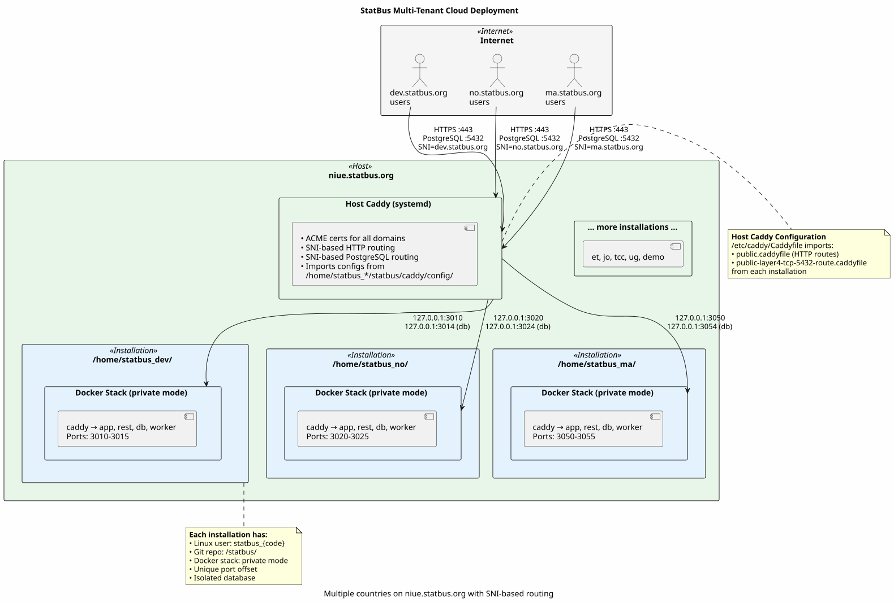
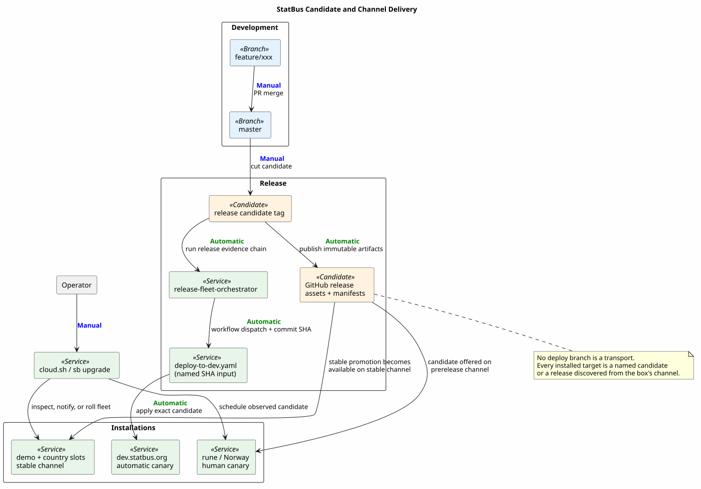

# StatBus Cloud Multi-Tenant Deployment

This guide is for **SSB staff** managing the multi-tenant cloud infrastructure on **niue.statbus.org**.

**Note**: For single-country deployments, see [DEPLOYMENT.md](DEPLOYMENT.md). SSB also operates one production-grade dedicated standalone instance — `no.statbus.org` on `rune.statbus.org` — which serves to keep the standalone code path exercised against real production traffic; see the [Related: SSB-operated standalone instances](#related-ssb-operated-standalone-instances) section below.



## Overview

The StatBus cloud infrastructure hosts multiple country instances on a single server (`niue.statbus.org`) with:

- **Shared public IP**: All instances share one public IP address (niue.statbus.org resolves to this IP)
- **SNI-based routing**: Host-level Caddy routes connections by domain name (e.g., dev.statbus.org, ma.statbus.org, no.statbus.org)
- **User-based isolation**: Each country instance runs under a dedicated Linux user (`statbus_<code>`)
- **Isolated databases**: Each country has separate PostgreSQL database and Docker network
- **Resource sharing**: Efficient use of server CPU, memory, and disk
- **Independent management**: Each instance can be updated/restarted independently
- **Automated deployment**: each instance's own upgrade service polls its channel and installs new releases on its own (STATBUS-244/248) — dev is the one exception, driven as the automatic canary

## Current Deployments

Active multi-tenant instances on niue.statbus.org:

| Code | Name | User | Domain | Offset |
|------|------|------|--------|--------|
| dev | Development | statbus_dev | dev.statbus.org | 1 |
| demo | Demo | statbus_demo | demo.statbus.org | 3 |
| tcc | Turkish Cypriotic Community | statbus_tcc | tcc.statbus.org | 4 |
| ma | Morocco | statbus_ma | ma.statbus.org | 5 |
| ug | Uganda | statbus_ug | ug.statbus.org | 6 |
| test | Test | statbus_test | test.statbus.org | 7 |
| et | Ethiopia | statbus_et | et.statbus.org | 8 |
| jo | Jordan | statbus_jo | jo.statbus.org | 9 |

**Moved off niue:**
- `no` (Norway) — migrated to a dedicated standalone box `rune.statbus.org` to dog-food the standalone deployment mode that external clients use. See [SSB-Operated Standalone Instances](#ssb-operated-standalone-instances). Port offset 2 stays reserved on niue for future use. The `statbus_no` Linux user and home were cleaned up from niue on 2026-04-21 after the rune install was verified live; final pre-decomm DB dumps are preserved on rune at `/home/statbus/statbus/tmp/` alongside the niue import source CSVs.

## Architecture

### Multi-Tenant User-Based Deployment

```
Clients worldwide
    ↓
    ↓ dev.statbus.org:443 (HTTPS)
    ↓ dev.statbus.org:5432 (PostgreSQL TLS+SNI)
    ↓ ma.statbus.org:443 (HTTPS)
    ↓ ma.statbus.org:5432 (PostgreSQL TLS+SNI)
    ↓
┌─────────────────────────────────────────────────────┐
│   niue.statbus.org - Host-level Caddy               │
│   • Terminates TLS for all domains                  │
│   • Routes HTTP/HTTPS by domain                     │
│   • Routes PostgreSQL by SNI (port 5432)            │
│   • Manages ACME certificates (Let's Encrypt)       │
│   • Imports configs from /home/statbus_*/statbus/   │
└─────┬───────────────────────┬───────────────────────┘
      │                       │
      ↓ HTTP/HTTPS            ↓ PostgreSQL
  127.0.0.1:3010          127.0.0.1:3014
      │                       │
┌─────────────────────────────────────────────┐
│ /home/statbus_dev/ (Linux user)             │
│   statbus/ (git repo)                       │
│     ├── caddy/config/                       │
│     │   ├── public.caddyfile (imported)     │
│     │   └── public-layer4-tcp-5432-route... │
│     └── docker containers:                  │
│         ├── statbus-dev-caddy (private mode)│
│         ├── statbus-dev-db                  │
│         ├── statbus-dev-rest                │
│         ├── statbus-dev-app                 │
│         └── statbus-dev-worker              │
└─────────────────────────────────────────────┘

┌─────────────────────────────────────────────┐
│ /home/statbus_ma/ (Linux user)              │
│   Similar structure for Morocco...          │
└─────────────────────────────────────────────┘
```

### Key Architecture Features

- **User-based isolation**: Each deployment runs under `statbus_<code>` Linux user
- **Git repo per deployment**: `/home/statbus_<code>/statbus/` contains complete repo
- **Deployment branch per country**: `ops/cloud/deploy/<code>` branch (e.g., `ops/cloud/deploy/ma`)
- **Host Caddy imports configs**: `/etc/caddy/Caddyfile` imports from all `/home/statbus_*/statbus/caddy/config/`
- **ACL permissions**: Host Caddy user has ACL read access to deployment configs
- **Automated deployment**: SSH-triggered script runs on push to deployment branch

### Key Benefits

✅ **Single IP address** for all countries  
✅ **Automatic HTTPS** with Let's Encrypt  
✅ **SNI-based PostgreSQL routing** (port 5432 shared)  
✅ **Independent upgrades** per country  
✅ **Resource efficiency** through Docker  
✅ **Isolated data** - each country has own database

---

## Prerequisites

### Server Requirements

- **OS**: Linux (Ubuntu 22.04 LTS or 24.04 LTS)
- **CPU**: 8+ cores (2 cores per instance recommended)
- **RAM**: 32+ GB (8 GB per instance recommended)
- **Disk**: 500+ GB SSD
- **Network**: Public IP with open ports 80, 443, 5432

### Software Requirements

- Docker 24.0+
- Docker Compose 2.20+
- Caddy 2.7+ (with caddy-l4 plugin)
- Git

---

## Initial Setup

### 1. Install Host-Level Caddy

```bash
# Install Caddy with Layer4 plugin
sudo apt install -y debian-keyring debian-archive-keyring apt-transport-https
curl -1sLf 'https://dl.cloudsmith.io/public/caddy/stable/gpg.key' | sudo gpg --dearmor -o /usr/share/keyrings/caddy-stable-archive-keyring.gpg
curl -1sLf 'https://dl.cloudsmith.io/public/caddy/stable/debian.deb.txt' | sudo tee /etc/apt/sources.list.d/caddy-stable.list

# Install Caddy (custom build with layer4)
# Note: You may need to build custom Caddy with layer4 plugin
sudo apt update
sudo apt install caddy

# Enable and start Caddy
sudo systemctl enable caddy
sudo systemctl start caddy
```

### 2. Configure Host-Level Caddy

The host-level Caddy configuration on `niue.statbus.org` is located at `/etc/caddy/Caddyfile`:

```caddyfile
{
    log {
        output stdout
        level DEBUG
    }
    
    layer4 {
        :5432 {
            # Import PostgreSQL Layer4 routes from all installations
            import /home/statbus_*/statbus/caddy/config/public-layer4-tcp-5432-route.caddyfile
        }
    }
}

# Import HTTP/HTTPS server blocks from all installations
import /home/statbus_*/statbus/caddy/config/public.caddyfile

# Additional static sites (optional)
statbus.org {
    redir https://www.statbus.org
}
www.statbus.org {
    root * /home/statbus_www/public_html
    file_server {
        index index.html
    }
    try_files {path} {path}.html {path}/index.html
}

log.statbus.org {
    reverse_proxy 127.0.0.1:5380  # Seq logging server
}
```

**Important**: The wildcard import `/home/statbus_*/statbus/caddy/config/public.caddyfile` automatically includes all deployment configs.

Reload Caddy after adding a new deployment:
```bash
sudo systemctl reload caddy
```

### 3. Configure ACL Permissions

The host Caddy process needs read access to deployment configs:

```bash
# Give Caddy user read access to deployment directories
# This is done automatically by create-new-statbus-installation.sh
sudo setfacl -m u:caddy:rx /home/statbus_<code>
sudo setfacl -m u:caddy:rx /home/statbus_<code>/statbus
sudo setfacl -m u:caddy:rx /home/statbus_<code>/statbus/caddy
sudo setfacl -m u:caddy:rx /home/statbus_<code>/statbus/caddy/config
sudo setfacl -m u:caddy:r /home/statbus_<code>/statbus/caddy/config/*.caddyfile
```

---

## Adding a New Country Instance

### Automated Script (Recommended)

Use the automated installation script from your local machine:

```bash
# From your local statbus repository
./ops/create-new-statbus-installation.sh <code> "<Name>" <version>

# Example:
./ops/create-new-statbus-installation.sh pk "Pakistan" v2026.08.0-rc.10
```

This script will:
1. Verify DNS setup (pk.statbus.org)
2. Declare the instance's upgrade ROLE (`UPGRADE_ROLE=production`). A new country instance is an ordinary production slot — it follows releases on its own and gets no push-triggered workflow and no deploy branch. The channel it follows (`stable`) is derived from the role on every `./sb config generate`, so it cannot drift out of date the way a stored channel could (STATBUS-254).
3. Create Linux user `statbus_pk` on niue.statbus.org
4. Add user to docker group
5. Configure SSH access for SSB GitHub users (jhf, hhz)
6. Generate SSH deployment key for GitHub
7. Bootstrap StatBus via `./sb install` (downloads CLI, pulls images, configures environment)
8. Create `.users.yml` from template
9. Determine next available port offset
10. Update deployment settings (CADDY_DEPLOYMENT_MODE=private, SITE_DOMAIN, etc.)
11. Copy SEQ_API_KEY and SLACK_TOKEN from statbus_dev
12. Configure ACL permissions for host Caddy
13. Start Docker services and initialize database

### Manual Steps (If Needed)

#### Step 1: Configure DNS

Ensure the apex DNS record points to niue.statbus.org (the api./www. subdomain
split is dead — every real slot runs a single apex record; caddy/templates
route by path, not by subdomain):

```bash
pk.statbus.org        A/CNAME → niue.statbus.org
```

#### Step 2 (retired, STATBUS-244): no GitHub deployment key, no workflow files, no deploy branch

The old Steps 2-4 (add a GitHub deployment key, commit `master-to-pk.yaml` + `deploy-to-pk.yaml`, push a deployment branch) are **retired** — only a named release candidate may reach an installation, so a new slot gets no push-triggered path at all. `UPGRADE_ROLE=production` derives the `stable` channel on every config generate (`cli/internal/config/upgrade_role.go`), so no channel setting is needed or possible; its upgrade service then discovers, registers, schedules, and installs releases on its own, without anyone pushing anything (STATBUS-248). Confirm the channel on the box rather than assuming it — and confirm it by reading the RUNNING service (`journalctl --user -u statbus-upgrade@$USER | grep 'Upgrade service started'`), not the file: the daemon loads its config only at startup, so a file that says `stable` proves nothing until the service has restarted.

#### Step 5: Configure Users

SSH to the server and edit `.users.yml`:

```bash
ssh statbus_pk@niue.statbus.org
cd ~/statbus
nano .users.yml
```

Example `.users.yml`:
```yaml
users:
  - email: admin@statbus.pk
    password: generate-secure-password-here
    role: admin_user
  - email: analyst@statbus.pk
    password: another-secure-password
    role: regular_user
```

**Important**: The `.users.yml` file must be different from `.users.example` or deployment will fail.

#### Step 6: Reload Host Caddy

```bash
# From niue.statbus.org as root
sudo systemctl reload caddy

# Verify configuration
sudo caddy validate --config /etc/caddy/Caddyfile
```

#### Step 7: Test Deployment

Confirm the box's own upgrade service reaches the current stable release on its own — no push involved:

```bash
ssh statbus_pk@niue.statbus.org "cd statbus && ./sb upgrade check"
ssh statbus_pk@niue.statbus.org "cd statbus && ./sb upgrade list"
```

`./sb upgrade check` fetches releases and registers candidates on the box's channel; the service schedules and applies the latest stable release without further action. To force it now rather than wait for the service's next tick, register + schedule the version explicitly (see "Operator workflow" above), or run `./sb install` on the box.

#### Step 8: Verify Access

```bash
# Test HTTPS
curl https://pk.statbus.org

# Test PostgreSQL (from another machine with PostgreSQL 17+ client)
PGHOST=pk.statbus.org PGPORT=5432 PGDATABASE=statbus PGUSER=admin@statbus.pk PGSSLNEGOTIATION=direct PGSSLMODE=verify-full PGSSLSNI=1 psql
```

---

## Port Allocation

Each instance gets unique ports based on `DEPLOYMENT_SLOT_PORT_OFFSET`. The formula is:

```
HTTP_PORT = 3000 + (OFFSET * 10)
HTTPS_PORT = 3000 + (OFFSET * 10) + 1  
DB_PORT = 3000 + (OFFSET * 10) + 14
REST_PORT = 3000 + (OFFSET * 10) + 1
```

Current allocations on niue.statbus.org:

| Code | Name | Offset | HTTP  | HTTPS | PostgreSQL | REST |
|------|------|--------|-------|-------|------------|------|
| dev  | Development | 1 | 3010  | 3011  | 3014       | 3011 |
| _no_ | _Norway (moved to rune.statbus.org)_ | _2_ | _3020_ | _3021_ | _3024_ | _3021_ |
| demo | Demo | 3      | 3030  | 3031  | 3034       | 3031 |
| tcc  | Turkish Cypriotic Community | 4 | 3040 | 3041 | 3044 | 3041 |
| ma   | Morocco | 5     | 3050  | 3051  | 3054       | 3051 |
| ug   | Uganda | 6      | 3060  | 3061  | 3064       | 3061 |
| test | Test | 7       | 3070  | 3071  | 3074       | 3071 |
| et   | Ethiopia | 8    | 3080  | 3081  | 3084       | 3081 |
| jo   | Jordan | 9      | 3090  | 3091  | 3094       | 3091 |

Offset 2 is reserved (kept for rollback if `no` ever needs to come back to niue).

**Public Ports** (shared by all instances):
- **80** (HTTP) → Host Caddy → redirects to HTTPS
- **443** (HTTPS) → Host Caddy → routes by domain to instance Caddy
- **5432** (PostgreSQL) → Host Caddy → routes by SNI to instance Caddy

**Note**: Next available offset is 10 for new deployments.

---

## Management

### Managing Individual Instances

Each instance is managed independently by SSH-ing as the deployment user:

```bash
# SSH to specific instance
ssh statbus_ma@niue.statbus.org
cd ~/statbus

# Stop services
./sb stop all

# Start services
./sb start all

# Restart services
./sb restart all

# View logs
./sb logs caddy
./sb logs db
./sb logs app

# Database operations
./sb psql
./sb migrate up

# Upgrades
./sb upgrade check                # Fetch new releases and register them as candidates
./sb upgrade list                 # List registered upgrade candidates and their status
./sb upgrade register v2026.03.1  # Record the target as a candidate (prereq for schedule)
./sb upgrade schedule v2026.03.1  # Queue it to run (fires NOTIFY; requires running service)
./sb install                      # Unified entrypoint: detects state and dispatches (step-table,
                                  # inline upgrade for a scheduled row, or crash-recovery)
```

**Operator workflow:** `./sb upgrade register <version>` records the candidate, then `./sb upgrade schedule <version>` writes the scheduled `public.upgrade` row. After that, either let the service run it (scheduling fires a NOTIFY; production norm), or run `./sb install` to dispatch inline — useful when you want the upgrade to run now without waiting, or when the service is stopped.

### Deployment model (STATBUS-244)

**The `master-to-X` "push master to a deploy branch" buttons are retired.** Only a named release candidate may ever reach an installation — master's tip has no tag, no gate, no artifact anyone reviewed, and it changes on every commit. Which mechanism a box gets depends on its role, never on pushing master anywhere:

- **Dev** — the automatic canary (STATBUS-247): every candidate reaches it without a human. *Transitional note:* until STATBUS-247's tag-driven deploy lands, `master-to-dev` and `ops/cloud/deploy/dev` remain the one deliberate exception — STATBUS-244b removes that button once 247 supplies its replacement.
- **Norway (`no`)** — the human canary: a person installs each candidate deliberately, against an observation card, on the `prerelease` channel. No push path.
- **Demo and the ordinary country slots** (`ma`, `et`, `jo`, `tcc`, `ug`, …) — channel-following (STATBUS-248, below): the box's own upgrade service polls its channel and installs on its own; promotion is what moves them, not a push. *True of intent, not yet fully true of mechanism:* `deploy-to-{et,jo,ma,tcc,ug}.yaml` still exist — only the buttons that wrote to their deploy branches (the retired `master-to-X`) are gone, so nothing writes those branches any more, but the listening workflows remain on disk. They are removed once STATBUS-248's Wave D1 channel confirmation proves each box actually follows its channel — deleting a live NSO box's only receive path before that is confirmed could strand it.



**On the server, once a version is targeted (any mechanism below):**

1. **CLI** writes upgrade request to database and sends PostgreSQL NOTIFY
2. **Upgrade service** handles the rest:
   - Backs up the database
   - Checks out the target version
   - Runs pending migrations
   - Restarts application containers with health checks
   - Recovers on failure by classification: rolls back where the box is behind target (data-safe under the read-only window); PARKS at-target deterministic failures to await a fix release
   - Sends callback notification (Slack)

View deployment status in GitHub Actions or Slack channel `statbus-utvikling`.

### Service-Based Deployment (the standard path for demo and the ordinary country slots)

Each instance runs an upgrade service that polls its channel and handles releases on its own — no push required. To trigger a specific version manually (a deliberate one-off, candidate-addressed rather than master-addressed):

```bash
ssh statbus_ma@niue.statbus.org "cd statbus && ./sb upgrade register v2026.03.1 && ./sb upgrade schedule v2026.03.1"
ssh statbus_ma@niue.statbus.org "cd statbus && ./sb upgrade check"
```

The upgrade service handles: image pull, backup, migrations, restart, health check, and classify-then-act recovery (automatic data-safe rollback behind target; a park awaiting a fix release at target — `doc/upgrade-recovery-model.md`). Progress is visible in the admin UI and via `journalctl -u statbus-upgrade@<user>`.

### Managing Host-Level Caddy

```bash
# Check status
sudo systemctl status caddy

# Reload configuration
sudo systemctl reload caddy

# Restart Caddy
sudo systemctl restart caddy

# View logs
sudo journalctl -u caddy -f

# Test configuration
sudo caddy validate --config /etc/caddy/Caddyfile
```

### Monitoring All Instances

Use the inspection script to get an overview of all deployments:

```bash
# From your local machine
./ops/inspect-cloud-installations.sh
```

This outputs connection information for all instances (frontend URLs, PostgreSQL credentials, SSH access).

Or manually check on the server:

```bash
# SSH as root
ssh root@niue.statbus.org

# Check all running containers
docker ps --format "table {{.Names}}\t{{.Status}}\t{{.Ports}}"

# Check disk usage
df -h
docker system df

# Check memory usage
free -h
docker stats --no-stream

# List all instances
ls -la /home/statbus_*/statbus/

# Check port allocations
grep DEPLOYMENT_SLOT_PORT_OFFSET /home/statbus_*/statbus/.env.config
```

---

## Backup and Recovery

### Individual Instance Backup

```bash
ssh statbus_ma@niue.statbus.org
cd ~/statbus

# Backup database
./sb db dump

# Backup configuration
tar -czf backup_ma_config_$(date +%Y%m%d).tar.gz .env.config .env.credentials .users.yml
```

### Restore Instance

```bash
ssh statbus_ma@niue.statbus.org
cd ~/statbus

# Restore database from dump
./sb db restore backup_ma_20240115.sql

# Restore configuration
tar -xzf backup_ma_config_20240115.tar.gz

# Regenerate .env
./sb config generate
```

### Automated Backups

Each instance now takes its **own** scheduled logical backup — built into the
always-on upgrade service, no crontab or external scheduler to install
(STATBUS-113). On the configured cadence the service runs `pg_dump -Fc` into the
instance's `dbdumps/` and prunes to a retention count, deferring automatically
whenever an upgrade is in progress. Configure per instance via `.env.config`:
`BACKUP_ENABLED` (default `true`), `BACKUP_INTERVAL` (default `24h`),
`BACKUP_RETENTION_COUNT` (default `7`). See
[DEPLOYMENT.md → Database Backup and Restore](DEPLOYMENT.md) for the full
description.

> The earlier `/root/backup-all-statbus.sh` + root-crontab recommendation is
> retired: it is superseded by this built-in per-instance backup. On the SSB
> multi-tenant cloud, disk-level/off-box copies remain an infra concern handled
> outside this repo.

---

## Troubleshooting

### Instance Won't Start

```bash
ssh statbus_ma@niue.statbus.org
cd ~/statbus

# Check container status
./sb ps

# View logs
./sb logs

# Check port conflicts
sudo netstat -tlnp | grep 3024

# Restart services
./sb restart all
```

### Host Caddy Routing Issues

```bash
# Test Caddy configuration
sudo caddy validate --config /etc/caddy/Caddyfile

# Check if routes are imported
sudo caddy adapt --config /etc/caddy/Caddyfile

# View Caddy logs
sudo journalctl -u caddy -n 100

# Reload Caddy
sudo systemctl reload caddy
```

### PostgreSQL Connection Failures

```bash
# On niue.statbus.org as root
# Check host Caddy is listening on 5432
sudo netstat -tlnp | grep 5432

# Check instance Caddy is listening on internal port (port = 3000 + offset*10 + 4, e.g. 3054 for Morocco)
ssh statbus_ma@niue.statbus.org 'cd ~/statbus && docker compose exec caddy netstat -tlnp | grep 3054'

# Test from host machine (as statbus_ma user)
PGHOST=127.0.0.1 PGPORT=3054 PGDATABASE=statbus PGUSER=postgres psql

# Check TLS certificate for a slot domain
echo | openssl s_client -connect ma.statbus.org:443 -servername ma.statbus.org
```

### DNS and Certificate Issues

```bash
# Check DNS resolution
nslookup no.statbus.org

# Should resolve to niue.statbus.org or its IP
dig no.statbus.org

# Check certificate
curl -vI https://no.statbus.org

# Force certificate renewal
sudo systemctl reload caddy
```

---

## Security Considerations

### Network Security

- **Firewall**: Configure UFW/iptables to only allow 22, 80, 443, 5432
- **SSH**: Key-based authentication only, disable password login
- **Docker**: Use user namespaces for additional isolation

```bash
# Configure firewall
sudo ufw default deny incoming
sudo ufw default allow outgoing
sudo ufw allow 22/tcp    # SSH
sudo ufw allow 80/tcp    # HTTP
sudo ufw allow 443/tcp   # HTTPS
sudo ufw allow 5432/tcp  # PostgreSQL
sudo ufw enable
```

### Instance Isolation

- Each instance runs in its own Docker network
- Containers cannot communicate between instances
- Databases are isolated
- Volumes are separate

### Access Control

- **Host machine**: SSH access restricted to SSB admins
- **Instance management**: Each country can manage their own instance
- **Database access**: Row Level Security enforced per user

### Monitoring

Set up monitoring for:
- Disk space (database growth)
- Memory usage per instance
- CPU usage
- Certificate expiration
- Container health
- Failed login attempts

---

## Scaling

### Adding More Countries

Use the automated script:

```bash
./ops/create-new-statbus-installation.sh <code> "<Name>" <version>
```

The script handles:
1. User creation (`statbus_<code>`)
2. Bootstrap via `./sb install`
3. Port offset assignment (next available)
4. Configuration generation
5. ACL permissions
6. Initial deployment

Host Caddy automatically picks up new routes via `import` wildcards in `/etc/caddy/Caddyfile`.

### Vertical Scaling

To handle more instances on same server:

1. **Add RAM**: 8 GB per additional instance
2. **Add CPU**: 2 cores per additional instance
3. **Add Disk**: Based on data volume per country

### Horizontal Scaling

To distribute instances across multiple servers:

1. Set up additional server with same host Caddy configuration
2. Update DNS to point some countries to new server IP
3. Deploy instances on new server following same process

---

---

# SSB-Operated Standalone Instances

In addition to the multi-tenant cloud on niue, SSB operates **dedicated standalone boxes** for individual production deployments. These are managed by the same SSB team, share the same Slack/Seq observability, and follow the same release cadence — but they run with `CADDY_DEPLOYMENT_MODE=standalone`, exactly as external clients deploy from [DEPLOYMENT.md](DEPLOYMENT.md). The point is to dog-food the standalone code path against real production traffic so we discover paper cuts before clients do.

## Active standalone instances

| Host | Domain served | OS / FS | Slot code | Deploy branch | Hardware |
|------|---------------|---------|-----------|---------------|----------|
| `rune.statbus.org` | `no.statbus.org` (Norway) | Ubuntu 24.04 LTS, mdadm RAID1 + XFS | `no` | `ops/standalone/deploy/rune-no` | Hetzner physical: Intel Xeon E3-1275v5 (4C/8T), 64 GB DDR4 ECC, 2× 512 GB NVMe RAID1, 1 Gbit |

Each standalone box has HTTPS and PostgreSQL TLS+SNI on its own public IP, served by Caddy inside Docker (port 80, 443, 5432). No host-level Caddy, no SNI multiplexing — same shape as a client install per [DEPLOYMENT.md](DEPLOYMENT.md).

## Naming convention

Short, memorable, tied to the geography it serves where possible. `niue` (a Pacific island) is the multi-tenant cloud — its deployments span continents, so a Pacific name is fitting (multi-cultural collection). `rune` is Norse and a common Norwegian first name, fitting for the box that hosts Norway's instance — easy to commit to memory.

New standalone boxes should follow the same spirit (short word with a tie to the deployment, easy to remember, easy to type).

## Operating a standalone instance

Two entry points, both available from the repo root:

**`./standalone.sh`** — fleet-level operator tool parallel to `./cloud.sh`. For when you're driving an operation from your workstation:

```bash
./standalone.sh status              # sb version on every registered host
./standalone.sh notify              # tell hosts to check for updates
./standalone.sh upgrade             # force every host to apply latest
./standalone.sh install rune-no     # re-run install.sh on rune (pinned or prerelease)
./standalone.sh install all         # same for every host
./standalone.sh inspect             # show hosts, served domains, slot codes, deploy branches
./standalone.sh wipe rune-no        # DESTRUCTIVE: delete DB and recreate (confirm prompt)
./standalone.sh ssh rune-no         # interactive shell as statbus@rune.statbus.org
```

The registry of hosts lives near the top of `standalone.sh` as a simple `HOSTS=()` array — one line per host with `name|ssh_fqdn|served_domain|slot_code`. Add a new host: append a line.

**Direct `./sb`** — when you want to run a specific operation on the host itself. Log in as the `statbus` service account (created by Stage 7 of `setup-ubuntu-lts-24.sh`):

```bash
# rune-no example
ssh statbus@rune.statbus.org
cd ~/statbus
./sb ps                        # container status
./sb logs proxy                # Caddy / ACME / TLS
./sb upgrade list                 # registered upgrade candidates
./sb upgrade register v2026.04.1  # record the target as a candidate
./sb upgrade schedule v2026.04.1  # queue it to run (fires NOTIFY)
./sb install                      # idempotent config refresh / dispatch pending upgrade
```

For host-level administration (journalctl, apt, systemctl system units, etc.) log in as `devops` instead.

**STATBUS-244: the force-push-master deploy path is retired everywhere**, multi-tenant and standalone alike. Rune-no (Norway) no longer has any push path at all — it is the human canary, and a person installs each candidate deliberately, on the `prerelease` channel, against an observation card (STATBUS-247). There is no `master-to-rune-no.yaml`, `deploy-to-rune-no.yaml`, or `ops/standalone/deploy/rune-no` branch any more. A future standalone box that is NOT a canary follows its channel on its own, the same as an ordinary cloud country slot (STATBUS-248) — see "Adding a new SSB standalone instance" below.

## Adding a new SSB standalone instance

The high-level shape (concrete walkthrough belongs in the per-host bootstrap plan; see [hetzner-bootstrap.md](hetzner-bootstrap.md) for Hetzner rescue → Ubuntu):

1. Provision the box. Install Ubuntu 24.04 LTS with the desired filesystem (mdadm RAID where applicable; XFS recommended for `/`).
2. Run `ops/setup-ubuntu-lts-24.sh` as root/sudo — creates `devops` + `statbus` accounts, hardens OS. `SKIP_STAGES="0"` if the network allows HTTP.
3. Bootstrap StatBus as the service account: `ssh statbus@<host>` then `curl -fsSL https://statbus.org/install.sh | bash -s -- --channel prerelease`.
4. Author `.env.config` with `CADDY_DEPLOYMENT_MODE=standalone`, `SITE_DOMAIN=<the public domain>`, `UPGRADE_ROLE=<production|canary>`, plus `SEQ_API_KEY` / `SLACK_TOKEN` copied from an existing instance for observability continuity. Use `canary` ONLY for a box we deliberately expose to release candidates first (Norway); an ordinary customer standalone is `production`.

   **Flagged, not settled (STATBUS-244a sweep):** steps 3-4's `prerelease` default predates the topology where Norway is named as THE single human canary (STATBUS-247). A NEW standalone box that is not itself a designated canary would, by that same logic, be an ordinary installation and belong on `stable` (STATBUS-248) — but nobody has ruled on that for a hypothetical future box, so the instruction is left as `prerelease` here rather than changed unilaterally. Confirm the intended role before provisioning the next one.
5. Retired (STATBUS-244): no `deploy-to-<host>-<slot>.yaml` / `master-to-<host>-<slot>.yaml` pair, no `ops/standalone/deploy/<host>-<slot>` branch. Only a named release candidate may reach an installation; the box's own upgrade service (channel set in step 4) discovers, registers, schedules, and installs on its own.
6. The existing repo `SSH_KEY` pubkey is already populated in `statbus`'s `authorized_keys` by `setup.sh` Stage 7 from the `GITHUB_USERS` list — no extra step needed if those users own the deploy key too.

For migrating an existing slot off niue (as `no` was migrated to rune): also dump the niue slot, restore on the new host, then stop the niue slot's containers and let DNS (CNAME on the public domain pointing at the new host) drive the cutover.

---

## Additional Resources

- **[Deployment Guide](DEPLOYMENT.md)**: Single instance deployment (the standalone shape used by both clients and SSB's own standalone boxes)
- **[Development Guide](DEVELOPMENT.md)**: For developers
- **[Service Architecture](doc/service-architecture.md)**: Technical architecture
- **[Integration Guide](INTEGRATE.md)**: API and PostgreSQL access

---

## Support

For SSB staff managing cloud and standalone infrastructure:
- Internal documentation: [SSB internal wiki]
- Contact: StatBus team at SSB
- Issues: https://github.com/statisticsnorway/statbus/issues
