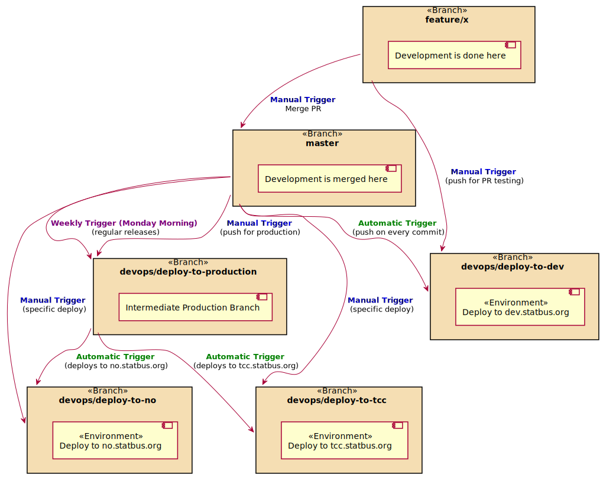

# STATBUS GitHub Action Deployments

Development primarily occurs on the `master` branch,
with deployments facilitated through specific `devops/` branches
to corresponding environments on the libu.statbus.no cloud server,
running Ubuntu LTS and hosted by Linode.

## Deployment Environments and Triggers

Deployments are configured as follows:

- **Development Environment**:
  - Branch: `devops/deploy-to-dev`
  - URL: [dev.statbus.org](https://dev.statbus.org/)
  - Workflow: [Deploy to Dev](https://github.com/statisticsnorway/statbus/actions/workflows/deploy-to-dev.yaml) (Triggered automatically on every commit to `master` and can be manually triggered for PR testing by force pushing into the branch with `git push origin HEAD:devops/deploy-to-dev`).
  
- **Production Environment (NO)**:
  - Branch: `devops/deploy-to-no`
  - Environment URL: [no.statbus.org](https://no.statbus.org/)
  - Workflows:
    - [Master to NO](https://github.com/statisticsnorway/statbus/actions/workflows/deploy-to-no.yaml) (Manually triggered for specific deployments)
    - Part of [Production to All](https://github.com/statisticsnorway/statbus/actions/workflows/production-to-all.yaml) (Automatic deployment from `devops/deploy-to-production`)

- **Production Environment (TCC)**:
  - Branch: `devops/deploy-to-tcc`
  - Environment URL: [tcc.statbus.org](https://tcc.statbus.org/)
  - Workflows:
    - [Master to TCC](https://github.com/statisticsnorway/statbus/actions/workflows/deploy-to-tcc.yaml) (Manually triggered for specific deployments)
    - Part of [Production to All](https://github.com/statisticsnorway/statbus/actions/workflows/production-to-all.yaml) (Automatic deployment from `devops/deploy-to-production`)

- **Production Intermediate**:
  - Branch: `devops/deploy-to-production`
  - This branch provides easy deployment to all production environments. It's updated from `master` through:
    - [Master to Production](https://github.com/statisticsnorway/statbus/actions/workflows/master-to-production.yaml) (Manually triggered for regular releases and specific deployments)
    - [Weekly Deploy to Production](https://github.com/statisticsnorway/statbus/actions/workflows/master-to-production.yaml) (A scheduled job every Monday morning)

# Deployment Process

- **Development**: All development work merges into the `master` branch.
	Each commit to `master` automatically triggers a deployment to the development environment (`dev.statbus.org`).
- **PR Testing**: For testing pull requests, any branch can be manually force-pushed to `devops/deploy-to-dev` for live environment testing.
- **Production**: Deployments to production (`no.statbus.org`, `tcc.statbus.org`) are managed through manual triggers or automated processes from the `devops/deploy-to-production` branch.

# Deployment Diagram

For a visual overview of the deployment process, refer to the diagram below:

## Future Plans

*TODO*
* `devops/deploy-to-demo` -> `demo.statbus.org`
* `devops/deploy-to-unstable` -> `unstable.statbus.org`

*Pending Discussion*
* `devops/deploy-to-qa-no` -> `qa-no.statbus.org`
* `devops/deploy-to-qa-tcc` -> `qa-tcc.statbus.org`

*TODO* Should we switch to a `develop` branch and auto deploy on merge to `master`?

Development is done in the `develop` branch.
Every commit to `develop` is pushed to `devops/deploy-to-unstable`.
For testing of PR's it is possible to manually force push any branch to
`devops/deploy-to-unstable` for testing.

The `dev` environment is removed and replaced by `unstable`.

When work is stable in the `develop` branch, it is merged to `master`.
Every commit to `master` is pushed to `devops/deploy-to-demo` for external testing.

Every commit to `master` is pushed to `devops/deploy-to-qa-*` for Quality Assurance testing
by the users of that installation.
When `qa-*.statbus.org` passes manual tests, then a manual job deploys
to `*.statbus.org`, by pushing the `devops/deploy-to-qa-*` branch to `devops/deploy-to-*`.

There are reset jobs to reset `devops/deploy-to-qa-*` from `devops/deploy-to-*` for testing of
database migrations, and verification of functionality with real life data.
