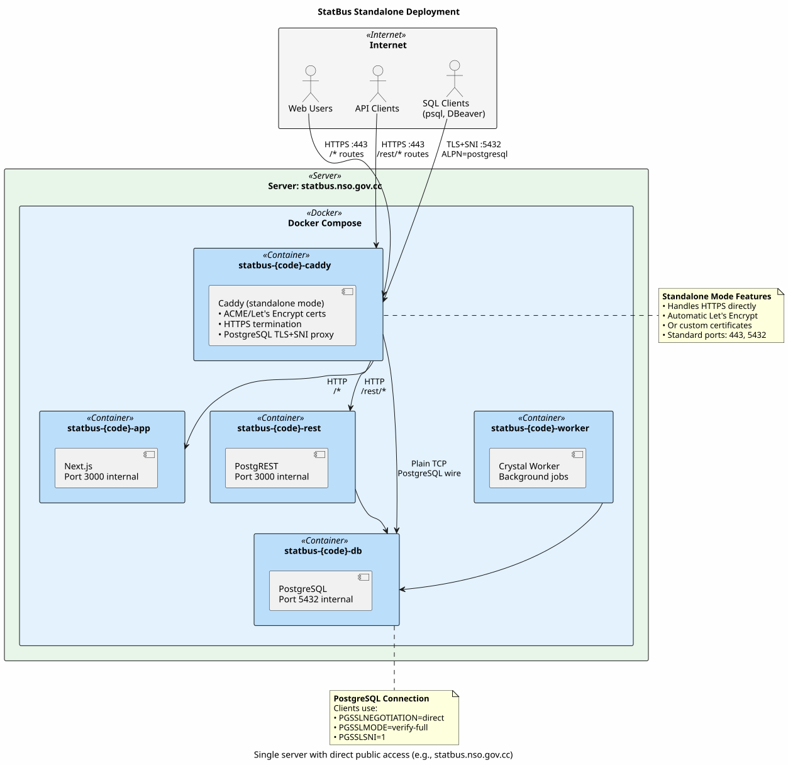

# StatBus Deployment Guide

## Removing an installation

Run `./uninstall.sh` from the service user's home after downloading it as shown
in [Quick Install](#quick-install), or run `./sb uninstall` from `~/statbus`.
The hosted alternative is `curl -fsSL https://statbus.org/uninstall.sh | bash`.
All entry points use the same standalone script. It lists every selected
Docker resource, unit file, and checkout path before asking for `DELETE`.
Interactive removal keeps `~/statbus/dbdumps/` and
`~/statbus/.env.credentials` by default. Non-interactive removal deletes
both and requires `STATBUS_UNINSTALL_CONFIRM=yes-delete-everything`.
Before reinstalling, copy any preserved dumps and credentials outside
`~/statbus`: the fresh installer replaces a non-Git checkout directory.

Details go to `~/statbus-uninstall.log`. The service account needs Docker
access, not sudo, to remove container-owned checkout files. The uninstaller
tests its Docker cleanup helper before stopping services and only removes
image tags attributable to this project and unused by other containers. A
legacy system-wide upgrade unit still requires an administrator with sudo
access. Host accounts, firewall rules, and apt settings belong to host
provisioning and are not removed. After full removal, run the regular
`install.sh` command for a fresh installation.

**Deletion boundary.** Docker 25 or newer is required. All recursive deletion
of the checkout runs inside a Docker helper that sees your home directory
through a private, non-recursive bind, so a directory mounted anywhere under
`~/statbus` is never entered or deleted. The uninstaller refuses before
stopping anything if it finds such a mount, or if Docker is older or cannot
be checked. One narrow case remains, disclosed here: before the confirmation
the uninstaller creates its own marker file `~/statbus/tmp/upgrade-in-progress.json`
(and `~/statbus/tmp` if it is missing). An administrator with root who mounts
another directory of the same filesystem onto `~/statbus` or `~/statbus/tmp`
exactly between the uninstaller's checks and that write, and detaches it
again, can make that one marker file (and `tmp`) be created, written or removed
in the mounted directory instead. No other file outside `~/statbus` can be
affected, and nothing outside it is deleted recursively.

This guide is for **system administrators** deploying StatBus for a single country or organization.

**Note**: For multi-tenant cloud deployments (hosting multiple countries), see [CLOUD.md](CLOUD.md).



## Table of Contents

- [Deployment Modes](#deployment-modes)
- [Single Instance Deployment](#single-instance-deployment)
- [Configuration](#configuration)
- [PostgreSQL Access Architecture](#postgresql-access-architecture)
- [Custom TLS Certificates](#custom-tls-certificates)
- [Automatic Upgrades](#automatic-upgrades)
- [Troubleshooting](#troubleshooting)
- [Security Considerations](#security-considerations)

---

## Deployment Modes

StatBus supports three deployment modes, controlled by the `CADDY_DEPLOYMENT_MODE` environment variable:

### 1. Development Mode

**Purpose**: Local development with hot-reload

**Characteristics**:
- HTTP on the slot's HTTP port, and HTTPS with a self-signed internal CA on the slot's HTTPS port
- PostgreSQL accessible on custom port (default: 3024)
- Domain: `local.statbus.org` (resolves to 127.0.0.1)
- Next.js runs separately on host machine (`pnpm run dev`)

**Use case**: Developers working on StatBus source code

#### Ports (slot offset 1, the usual local layout)

The web entry point serves **plain HTTP and TLS on two different ports**. Sending
TLS to the HTTP port produces the browser error `SSL_ERROR_RX_RECORD_TOO_LONG`,
because the server answers in plaintext.

| Port | Service | Notes |
| :--- | :--- | :--- |
| 3010 | Caddy proxy, **HTTP** | Use `http://local.statbus.org:3010` |
| 3011 | Caddy proxy, **HTTPS** | Use `https://local.statbus.org:3011`; self-signed internal CA, so the browser warns |
| 3012 | Next.js app directly | Bypasses the proxy |
| 3013 | PostgREST (`/rest`) | The API the browser calls |
| 3014 | PostgreSQL, plaintext | Convenient for local tooling |
| 3015 | PostgreSQL, TLS + SNI | Production-like connections |
| 3016 | PostgREST admin server | Loopback only, internal readiness signal |

Each deployment slot adds 10 to 3000 for its own set of ports, so slot offset 2
uses 3020-3026 and so on.

### 2. Standalone Mode

**Purpose**: Single-server production deployment

**Characteristics**:
- Handles HTTPS directly with automatic ACME/Let's Encrypt certificates
- Supports custom certificates (for organizations with their own CA)
- PostgreSQL accessible on standard port 5432 with TLS+SNI
- All services run in Docker
- Direct public access without additional proxy

**Use case**: National statistical office deploying for one country

**Requirements**:
- Public domain name (e.g., `statbus.example.com`)
- DNS A record pointing to server IP
- Open ports: 80 (HTTP), 443 (HTTPS), 5432 (PostgreSQL)

### 3. Private Mode

**Purpose**: Behind host-level reverse proxy

**Characteristics**:
- HTTP only (HTTPS handled by host proxy)
- Trusts X-Forwarded-* headers from proxy
- PostgreSQL forwarding from host proxy to Docker network
- Multiple instances can run on same host (different ports)

**Use case**: Part of multi-tenant cloud deployment

---

## Single Instance Deployment

This section covers deploying StatBus for a single country or organization.

### Prerequisites

**Server Requirements**:
- **OS**: Linux (Ubuntu 26.04 LTS is the primary tested OS; Ubuntu 24.04 LTS remains supported)
- **CPU**: 4 cores minimum
- **RAM**: 16 GB minimum
- **Disk**: 20 GB free minimum on both Docker storage and the backup filesystem; 40 GB free recommended for getting started. Plan more capacity as data grows.
- **Network**: Public IP address with open ports 80, 443, 5432

**Software Requirements**:
- Docker 24.0+
- Docker Compose 2.20+
- Git

#### Installing Prerequisites on Ubuntu

**Install Git**:
```bash
sudo apt update
sudo apt install -y git
```

**Install Docker and Docker Compose**:

Add Docker's official GPG key:
```bash
sudo apt install -y ca-certificates curl gnupg
sudo install -m 0755 -d /etc/apt/keyrings
curl -fsSL https://download.docker.com/linux/ubuntu/gpg | sudo gpg --dearmor -o /etc/apt/keyrings/docker.gpg
sudo chmod a+r /etc/apt/keyrings/docker.gpg
```

Add Docker repository:
```bash
echo \
  "deb [arch=$(dpkg --print-architecture) signed-by=/etc/apt/keyrings/docker.gpg] https://download.docker.com/linux/ubuntu \
  $(. /etc/os-release && echo "$VERSION_CODENAME") stable" | \
  sudo tee /etc/apt/sources.list.d/docker.list
```

Install Docker:
```bash
sudo apt update
sudo apt install -y docker-ce docker-ce-cli containerd.io docker-buildx-plugin docker-compose-plugin
```

Add your user to docker group (to run docker without sudo):
```bash
sudo usermod -aG docker $USER
newgrp docker
```

**Important Docker Security Note**:
Docker Compose bypasses UFW firewall rules. Ensure you carefully review which ports are exposed in docker-compose.yml files. StatBus minimizes exposure by binding sensitive ports to localhost only in private mode.

### Server Setup (Required)

Before installing StatBus, run the setup script to harden the OS and create
the accounts StatBus expects. Ubuntu 24.04 LTS and Ubuntu 26.04 LTS are
supported. This is step 1 of a two-phase install:

```bash
curl -fsSL https://raw.githubusercontent.com/statisticsnorway/statbus/master/ops/setup-ubuntu-lts.sh -o setup.sh
chmod +x setup.sh
sudo ./setup.sh
```

The script configures:
- HTTPS APT sources (optional, for networks that block HTTP)
- SSH key-only authentication (no passwords)
- Automatic security updates
- CrowdSec intrusion detection and UFW firewall (optional for private networks)
- Docker CE + Compose plugin
- `devops` user (ops/admin) with passwordless sudo, docker group, and GitHub
  SSH keys
- **`statbus` service account** (Stage 7) — this is the user StatBus itself
  will be installed under and operated as. Docker group membership; SSH keys
  from the same GitHub users; systemd `--user` linger enabled

**For STATBUS deployments:**
- **Skip Stage 0** if your network allows HTTP (use `SKIP_STAGES="0"`). Our
  recommendation on Hetzner dedicated / standard cloud hosts.
- **Skip Stage 4** only if your server is on a private network with existing
  firewall infrastructure.

See [setup-ubuntu-lts.md](setup-ubuntu-lts.md) for full details.
For Hetzner physical hosts booted in rescue mode, also see
[hetzner-bootstrap.md](hetzner-bootstrap.md).

### Quick Install

After setup finishes, **log in as the service account** (not as devops or
ubuntu) and run the StatBus installer:

```bash
ssh statbus@<your-host>
cd "$HOME"
curl -fsSL https://raw.githubusercontent.com/statisticsnorway/statbus/master/install.sh -o install.sh
curl -fsSL https://raw.githubusercontent.com/statisticsnorway/statbus/master/uninstall.sh -o uninstall.sh
chmod +x install.sh uninstall.sh
./install.sh --channel stable
```

Supported channels are `stable` (the default, latest stable release) and
`prerelease` (latest release candidate). To choose the latter, run
`./install.sh --channel prerelease` instead. Keep the downloaded uninstaller
outside `~/statbus`; to remove the installation later, run
`cd "$HOME" && ./uninstall.sh` as the same service user.

This is an interactive install. The hosted alternative,
`curl -fsSL https://statbus.org/install.sh | bash`, reconnects standard input
to the controlling terminal before asking its questions. Without a terminal,
use the unattended form below.

#### Unattended install

As the service account, create a file with **these deployment answers and explicit trust choice**, the same
questions asked by the interactive installer:

```dotenv
CADDY_DEPLOYMENT_MODE=standalone
SITE_DOMAIN=statbus.nso.eu
DEPLOYMENT_SLOT_NAME=StatBus
DEPLOYMENT_SLOT_CODE=nso
TRUST_GITHUB_USER=jhf
```

| Key | Interactive prompt |
|---|---|
| `CADDY_DEPLOYMENT_MODE` | Deployment mode (development/standalone/private) |
| `SITE_DOMAIN` | Domain name |
| `DEPLOYMENT_SLOT_NAME` | Display name |
| `DEPLOYMENT_SLOT_CODE` | Deployment code (short, lowercase) |
| `TLS_CERT_FILE` | TLS certificate fullchain file (custom certificate) |
| `TLS_KEY_FILE` | TLS certificate private key file (custom certificate) |
| `TRUST_GITHUB_USER` | Release signer to trust (GitHub username). Releases are signed; this names the GitHub user whose published signing key the installer verifies release tags against; jhf is the SSB release signer. |

`TLS_CERT_FILE` and `TLS_KEY_FILE` are optional and must be given together; they select the custom-certificate path (see Custom TLS Certificates below) and are never asked interactively.

Keep this input outside `~/statbus`, which the installer clones itself. Protect
it with mode `0600` and explicitly export its path before running the installer:

```bash
chmod 0600 "$HOME/install-input.env"
export STATBUS_ENV_CONFIG="$HOME/install-input.env"
# Optional: explicitly provide your existing user definitions for first install.
export STATBUS_USERS_FILE="$HOME/initial-users.yml"
# Optional: choose a release instead of latest stable.
export STATBUS_INSTALL_VERSION='<release-tag>'
curl -fsSL https://statbus.org/install.sh | bash -s -- --non-interactive
```

For a candidate, set `STATBUS_INSTALL_VERSION=<candidate-tag>` (or use the
compatible `--version <candidate-tag>` flag) and use that candidate's `install.sh`
file if the hosted script does not yet carry this feature. Different explicit
version answers refuse before downloads; matching values are accepted. Relative
paths resolve from the invoking directory, before the script changes directory.
No well-known home filename is searched. The shell passes these paths through;
`./sb install` validates and imports them, so direct CLI installs have the same
contract. A missing key names both the key and its prompt. Extra keys, duplicate
keys, empty values and malformed declarations are refused. With no input path,
a fresh `--non-interactive` install prints a complete recipe with the input keys,
recommended signer, environment variables and rerun instruction.

`TRUST_GITHUB_USER=jhf` is explicit consent to trust the recommended signer
(Jorgen H. Fjeld, https://github.com/jhf), not an automatic consequence of
non-interactive mode. Releases are signed; this names the GitHub user whose
published signing key the installer verifies release tags against; jhf is the SSB
release signer. The installer fetches and persists the actual signing key through
the existing trust step, never copies this input username into runtime
`.env.config`. Interactive installation asks at that step and displays key
fingerprints. The legacy `--trust-github-user` flag may supply the answer instead;
if both file and flag provide it, they must agree. No separate trust environment
variable is required. Version selection remains a bootstrap input, not a file key.

`DEPLOYMENT_SLOT_PORT_OFFSET=1` is a fixed installer output, **not an input key**.
Other tuning such as REST URLs, debug flags or a nondefault upgrade channel is
applied **after** the first installation, just as with interactive installation:

```bash
cd "$HOME/statbus"
./sb dotenv -f .env.config set UPGRADE_CHANNEL prerelease
./sb config generate
./sb restart all
```

`sb restart all` (also `all_except_app`) safely stops an active upgrade daemon,
waits for the application stack to be healthy, then starts the daemon with the new settings.
The upgrade mutex remains held until the daemon reports database connection and
LISTEN readiness. A failed or interrupted restart retains an explicit restart
barrier. Fix the reported cause and retry the same `sb restart <profile>` command.
`sb install` refuses that barrier before probing the database, and no operator
`systemctl` command is needed.
An upgrade/install marker causes refusal before any service disruption, including
stale recovery markers: finish the operation or use `sb install` to recover.
An intentionally inactive daemon stays inactive. `sb restart app` remains narrow.
No systemd lifecycle command is required from the operator.

Only first-time configuration creation requires the input file. Existing
configuration belongs to the box: repair, rescue and internal upgrade fixups
neither demand this file nor re-import it. Inputs are retained, so protect or
remove credential-bearing files after installation. This seam first ships after
v2026.09.0. The default upgrade channel is derived from the chosen deployment
mode, not from the presence of unattended inputs.

For a specific version (e.g. a release candidate, or downgrading):
```bash
ssh statbus@<your-host>
curl -fsSL https://statbus.org/install.sh | bash -s -- --version v2026.03.0-rc.25
```

`install.sh` always installs into `${HOME}/statbus/` of the invoking user;
that's why it must be run as `statbus` specifically. Running as `devops` or
the default cloud-image user places the install in the wrong home.

The installer:
- Detects your OS and architecture
- Downloads the `sb` CLI binary from the latest GitHub release
- Runs `./sb install` which bootstraps the full environment (Docker images, configuration, database)

After installation, follow the on-screen instructions to configure and start STATBUS.

> **If the server already has an upgrade service running**, stop it before re-invoking the installer, or use `./cloud.sh install <server>` which handles this automatically. `./sb install` refuses to proceed if an orchestrated upgrade is in flight (see [upgrade-timeline.md](upgrade-timeline.md#flag-file-mutex-install--service)).
> ```bash
> systemctl --user stop 'statbus-upgrade@*.service'
> curl -fsSL https://statbus.org/install.sh | bash -s -- --channel prerelease
> ```

### Manual Installation Steps

If you prefer manual installation, follow these steps:

#### 1. Clone Repository

```bash
# On your server
git clone https://github.com/statisticsnorway/statbus.git
cd statbus
```

#### 2. Configure Git Hooks

```bash
git config core.hooksPath .githooks
```

#### 3. Create the first administrator during installation

Run `./sb install` as the application user. If no `.users.yml` is present, it
asks for the first administrator's email and name, then reads and confirms the
password without echoing it. Do not put a plaintext password in the deployment
guide or a shell command. For automated installation only, supply an explicit
`STATBUS_USERS_FILE` path to a protected answers file.

#### 4. Generate Configuration

```bash
./sb config generate
```

This creates:
- `.env` - Main environment file (generated, do not edit directly)
- `.env.credentials` - Secure credentials (generated once, keep secret)
- `.env.config` - Deployment configuration (edit this for your setup)

#### 6. Edit Deployment Configuration

```bash
nano .env.config
```

**Key settings for standalone deployment**:

```bash
# Deployment identification
DEPLOYMENT_SLOT_NAME="Your Country StatBus"
DEPLOYMENT_SLOT_CODE="your_country"  # Short code (lowercase, no spaces)

# Deployment mode
CADDY_DEPLOYMENT_MODE=standalone

# Your public domain
SITE_DOMAIN=statbus.example.com

# Network addresses and ports are computed from deployment mode and slot.
```

After editing, regenerate:
```bash
./sb config generate
```

#### 5. Start Services

```bash
# Start all Docker containers
./sb start all

# Initialize database (first time only)
./sb migrate up
./sb users create
```

#### 6. Verify Deployment

```bash
# Check all services are running
./sb ps

# Check Caddy logs
./sb logs proxy

# Check database connectivity
./sb psql -c "SELECT version();"
```

#### 7. Access Your Instance

- **Web Interface**: https://statbus.example.com
- **API**: https://statbus.example.com/rest/
- **PostgreSQL**: statbus.example.com:5432 (with TLS)

### Ongoing Management

**Start/Stop Services**:
```bash
./sb stop all
./sb start all
```

**View Logs**:
```bash
./sb logs proxy   # Caddy logs
./sb logs db      # PostgreSQL logs
./sb logs app     # Next.js logs
./sb logs rest    # PostgREST logs
```

**Database Backup and Restore**:
```bash
./sb db dump                    # Backup to dbdumps/ (manual, on-demand)
./sb db dumps list              # List available dumps
./sb db dumps purge <N>         # Keep newest N dumps per source, delete the rest
./sb db restore <file>          # Restore from dump
```

**Upgrade logs travel with the dump** (STATBUS-456): `./sb db dump` and
`./sb db download <code>` also write a companion archive
`dbdumps/<stem>.logs.tar.zst` (gzip when the `zstd` binary is unavailable)
beside the `.pg_dump`. It carries `tmp/upgrade-logs/` (minus the `latest`
symlink) plus only the `tmp/install-logs/` files the dumped database actually
references, so a restored copy can show the logs its `public.upgrade` rows
point at. `./sb db restore <file>` unpacks the companion into `tmp/`,
merging with what is already on disk; when no companion exists the restore
still succeeds and prints that logs were not included. `db dumps list` shows
whether a dump carries its logs, and `db dumps purge` deletes dump and
companion as one unit. The companion contains log content from the source
box — treat it as exactly as sensitive as the dump itself.
`./sb db restore <file> --to <code>` (remote restore) does not upload the
companion.

**Built-in scheduled backup** (standalone): the always-on upgrade service takes a
regular logical backup automatically — no cron, systemd timer, or external
scheduler to install (it is part of the service you already run). On standalone
installs this **is** the database backup, so it is enabled by default.

- **What it does**: on the configured cadence it runs `pg_dump -Fc` into
  `dbdumps/` (atomically — a partial/interrupted dump never overwrites a good
  one), then prunes the directory to the retention count.
- **When it runs**: every `BACKUP_INTERVAL`, plus a catch-up at service start if
  the last dump is older than the interval (so a backup missed while the box was
  off runs as soon as it comes back).
- **Coordination**: it automatically **skips** while an upgrade is in progress
  (the upgrade takes its own snapshot) and never runs two backups at once; a
  backup failure is logged (and sent to `UPGRADE_CALLBACK` if configured) but
  never crashes the service.
- **Where dumps land**: `dbdumps/<slot>_<timestamp>.pg_dump` in the instance
  directory. Restore any of them with `./sb db restore <file>`.

Tune or disable it in `.env.config` (then `./sb config generate`):

| Setting | Default | Meaning |
|---|---|---|
| `BACKUP_ENABLED` | `true` | Set `false` to opt out (e.g. a box with its own infra-level snapshots). |
| `BACKUP_INTERVAL` | `24h` | Cadence (Go duration, e.g. `12h`, `48h`). |
| `BACKUP_RETENTION_COUNT` | `7` | Dumps kept per source prefix; older ones are pruned. |

> Note: the scheduled backup pauses while the service is stopped. If you take the
> service down for an extended period, run `./sb db dump` manually; the next
> service start also catches up an overdue backup.

**Apply Migrations**:
```bash
./sb migrate up
```

**Update StatBus**:

Updates are handled automatically by the upgrade service. To manually trigger:
```bash
./sb upgrade check                   # Fetch new releases and register them as candidates
./sb upgrade register v2026.03.1     # Record the target as a candidate (prepares it)
./sb upgrade schedule v2026.03.1     # Queue it to run (fires NOTIFY; requires running service)
./sb install                         # Alternative: dispatch any scheduled row inline,
                                     # without waiting for the service tick
```

`./sb install` is the unified entrypoint — safe to run on a healthy install (acts as an idempotent config refresh), and it routes to inline upgrade when a scheduled row is pending. See `doc/upgrade-timeline.md` for the full dispatch ladder.

---

## Configuration

### Environment Variables

StatBus uses a layered configuration approach:

```
.env.credentials (generated once, contains secrets)
       +
.env.config (edit this for deployment settings)
       ↓
   generate-config
       ↓
     .env (generated, used by Docker Compose)
```

**Key Configuration Files**:

| File | Purpose | Edit? |
|------|---------|-------|
| `.env.config` | Deployment settings | ✅ Yes |
| `.env.credentials` | Secure credentials | ❌ No (generated once) |
| `.env` | Generated environment | ❌ No (regenerated) |
| `.users.yml` | Initial user accounts | ✅ Yes |

### Important Environment Variables

**Deployment Identity**:
- `DEPLOYMENT_SLOT_NAME`: Human-readable name
- `DEPLOYMENT_SLOT_CODE`: Short code for URLs and container names

**Network Configuration**:
- `CADDY_HTTP_BIND_ADDRESS`: IP for HTTP (default: `0.0.0.0`)
- `CADDY_HTTPS_BIND_ADDRESS`: IP for HTTPS (default: `0.0.0.0`)
- `CADDY_DB_BIND_ADDRESS` and `CADDY_DB_PORT`: generated from deployment mode and slot, not operator inputs

**Deployment Mode**:
- `CADDY_DEPLOYMENT_MODE`: `development` | `standalone` | `private`

**Domain**:
- `SITE_DOMAIN`: Your public domain (required for standalone and private modes)

**Docker Build** (for HTTPS-only networks):
- `APT_USE_HTTPS_ONLY`: Set to `true` if your network blocks HTTP traffic. This switches Docker image builds to use HTTPS mirrors for apt packages. Default: `false`

> **Note**: The install script (`statbus.org/install.sh`) automatically detects your platform. For HTTP-blocked networks, enable this setting manually.

### Docker Compose Profiles

Control which services start:

```bash
# All services (default)
./sb start all

# Backend only (no Next.js app)
./sb start all_except_app
```

---

## PostgreSQL Access Architecture

### Standalone Mode Architecture

```
Client (psql, app)
    ↓ TLS connection to statbus.example.com:5432
    ↓ with SNI = statbus.example.com
    ↓ and ALPN = postgresql
    ↓
Caddy (Layer4 TLS proxy)
    ↓ Terminates TLS using ACME certificate
    ↓ Matches SNI + ALPN
    ↓ Forwards plain TCP to db:5432 (Docker network)
    ↓
PostgreSQL container
    ✓ Receives plain TCP connection
```

**Benefits**:
- TLS encryption for all PostgreSQL connections
- PostgreSQL doesn't need TLS configuration
- Standard port 5432
- Automatic certificate management via Let's Encrypt

### Connection Details

Users connect with:
```bash
export PGHOST=statbus.example.com
export PGPORT=5432
export PGDATABASE=statbus
export PGUSER=username
export PGPASSWORD=password
export PGSSLNEGOTIATION=direct
export PGSSLMODE=verify-full
export PGSSLSNI=1
psql
```

See [Integration Guide](INTEGRATE.md#postgresql-direct-access-level-3) for detailed connection examples.

---

## Custom TLS Certificates

By default, standalone mode uses automatic ACME certificates from Let's Encrypt. If your organization requires using its own certificates (e.g., from an internal CA or a specific certificate provider), you can configure StatBus to use custom certificates instead.

### Recommended: `./sb cert install`

Use the certificate CLI, not manual `mkdir`/`cp`/`.env.config` edits. It validates the certificate/key pair, shows you the cert details before writing anything, places the files, updates `.env.config`, regenerates Caddy's configuration, restarts the proxy, and probes `https://SITE_DOMAIN` to confirm Caddy is actually serving the new certificate:

```bash
cd ~/statbus

# PFX / PKCS#12 (single file, password-protected) — common CA export format
./sb cert install ~/Downloads/your-cert.pfx

# Separate PEM files — fullchain certificate + private key
./sb cert install ~/fullchain.pem ~/privkey.pem
```

`./sb cert install` also repairs the operational snag that trips up existing boxes: once the proxy container has started at least once, Docker owns `caddy/data/` as `root:root`, so a normal user cannot write under it directly — whether `custom-certs/` was never created, or already exists (e.g. from an earlier manual `sudo mkdir`) but is still not writable. `./sb cert install` probes real writability and repairs `caddy/data/custom-certs/` itself (via a throwaway container, the same mechanism the installer uses to repair root-owned backup directories) — no `sudo` required, and Caddy's own certificate state under `caddy/data/caddy/` is left untouched.

Other useful subcommands:

```bash
./sb cert show      # inspect the certificate Caddy is currently serving
./sb cert remove     # revert to automatic Let's Encrypt (ACME) issuance
```

Run `./sb cert install --help` for the full detection rules (PFX vs PEM, content-based not extension-based) and `./sb cert show --help` / `./sb cert remove --help` for their details.

The rest of this section documents the on-disk layout and the manual steps `./sb cert install` performs, for reference and troubleshooting — you should not need to run them by hand.

### Certificate Requirements

Your certificate files must be:
- **PEM format** (base64 encoded)
- **Fullchain format** for the certificate file (server certificate + intermediate CA certificates concatenated)
- **Unencrypted** private key (no password protection)

### Directory Structure

Caddy's data directory is mounted at `caddy/data/`:

```
caddy/data/
├── caddy/              # Caddy-managed (ACME certs, internal PKI)
│   ├── certificates/   # Auto-obtained certificates
│   └── pki/            # Internal CA for development mode
└── custom-certs/       # Your custom certificates go here
```

The `caddy/data/` directory is gitignored to protect sensitive private keys.

### Manual Setup (reference — prefer `./sb cert install` above)

#### 1. Prepare Certificate Files

**Option A: Converting from PFX/PKCS#12 format**

If your provider supplies a `.pfx` or `.p12` file, extract the certificate and key with OpenSSL into protected files, then configure the certificate paths as described below. Do not commit private keys.

**Option B: From separate PEM files**

If you received separate certificate and CA chain files, concatenate them into fullchain format:

```bash
# Concatenate server cert + intermediate CA(s) + root CA (if provided)
cat server.crt intermediate.crt > caddy/data/custom-certs/domain.crt

# Or if you have a separate CA bundle file:
cat server.crt ca-bundle.crt > caddy/data/custom-certs/domain.crt

# Copy the private key
cp server.key caddy/data/custom-certs/domain.key

# Set secure permissions
chmod 600 caddy/data/custom-certs/domain.key
```

The fullchain order should be:
1. Server certificate (your domain)
2. Intermediate CA certificate(s)
3. Root CA certificate (optional, usually not needed)

#### 2. Configure Environment

Edit `.env.config` and set the certificate paths:

```bash
# Custom TLS certificate paths (inside container)
TLS_CERT_FILE=/data/custom-certs/domain.crt
TLS_KEY_FILE=/data/custom-certs/domain.key
```

#### 3. Regenerate Configuration

```bash
./sb config generate
```

This updates the Caddy configuration to use your custom certificates instead of ACME.

#### 4. Restart Caddy

```bash
docker compose restart proxy
```

#### 5. Verify Certificate

**HTTPS (web interface and API)**:
```bash
# Check certificate details
openssl s_client -connect your-domain.com:443 -servername your-domain.com < /dev/null 2>/dev/null | openssl x509 -noout -text | head -20

# Or use curl
curl -vI https://your-domain.com 2>&1 | grep -A5 "Server certificate"
```

**PostgreSQL TLS (port 5432)**:

For low-level inspection of the PostgreSQL TLS connection (useful for debugging SNI/ALPN issues):
```bash
openssl s_client -connect your-domain.com:5432 \
  -servername your-domain.com \
  -alpn postgresql \
  -showcerts
```

This verifies:
- TLS certificate is valid and trusted
- SNI (Server Name Indication) is working
- ALPN negotiation for `postgresql` protocol succeeds

For functional verification, use psql:
```bash
PGSSLMODE=verify-full PGSSLNEGOTIATION=direct psql -h your-domain.com -p 5432 -U username -d statbus -c "SELECT 1"
```

### Switching Back to ACME

To return to automatic Let's Encrypt certificates, run:

```bash
cd ~/statbus
./sb cert remove
```

This archives the current certificate files to `caddy/data/custom-certs/archive/<timestamp>/` (not deleted — retrievable later), clears `TLS_CERT_FILE`/`TLS_KEY_FILE` in `.env.config`, regenerates Caddy's configuration, and restarts the proxy. Caddy then requests a fresh certificate from Let's Encrypt on the first HTTPS request, provided `SITE_DOMAIN` is publicly reachable on ports 80/443.

### Certificate Renewal

**Custom certificates**: You are responsible for renewing certificates before expiry. Renew by running `./sb cert install` again with the new files — it places them, updates `.env.config`, regenerates Caddy's configuration, restarts the proxy, and verifies the new certificate is being served:
```bash
cd ~/statbus
./sb cert install <full path to certificate> <full path to key>
```

**ACME certificates**: Caddy handles renewal automatically (no action needed).

### Inspecting Certificates

You can inspect both ACME-managed and custom certificates directly on the host:

```bash
# View ACME certificates (if using Let's Encrypt)
ls -la caddy/data/caddy/certificates/

# View custom certificates
ls -la caddy/data/custom-certs/

# Check certificate expiry
openssl x509 -in caddy/data/custom-certs/domain.crt -noout -enddate
```

### Troubleshooting Custom Certificates

**Certificate not loading**:
```bash
# Check Caddy logs for TLS errors
docker compose logs proxy | grep -i tls

# Verify certificate chain is valid
openssl verify -CAfile ca-bundle.crt caddy/data/custom-certs/domain.crt
```

**"certificate signed by unknown authority"**:
- Ensure the fullchain includes all intermediate certificates
- Verify the certificate order (server cert first, then intermediates)

**Permission denied**:
```bash
# Ensure files are readable by the container
chmod 644 caddy/data/custom-certs/domain.crt
chmod 600 caddy/data/custom-certs/domain.key
```

---

## Automatic Upgrades

StatBus includes an upgrade service that automatically checks for new releases, downloads Docker images, and applies upgrades with backup and rollback support.

### Enabling the Upgrade Service

Enable the upgrade service via systemd:

```bash
sudo systemctl enable --now statbus-upgrade@<slot>.service
```

Replace `<slot>` with your deployment slot code (e.g., `local`, `no`, `demo`). The service file is at `ops/statbus-upgrade.service`.

### Configuration

Configure upgrade behavior in `.env.config`, then run `./sb config generate`:

| Variable | Default | Description |
|----------|---------|-------------|
| `UPGRADE_CHANNEL` | *(unset)* | **An exception, not a requirement.** Leave it unset and the box follows the channel its `CADDY_DEPLOYMENT_MODE` derives: `standalone` → `stable`, `private` → `stable`, `development` → `local`. Set it only for a box that deliberately leads — e.g. `prerelease` on a box that should see release candidates before a statistical office does. A written value always wins over the derivation (STATBUS-307) |
| `UPGRADE_CHECK_INTERVAL` | `6h` | How often the service polls GitHub for new releases |
| `UPGRADE_AUTO_DOWNLOAD` | `true` | Pre-download Docker images when a new release is discovered |
| `UPGRADE_CALLBACK` | *(empty)* | Shell command run on install completion and on every upgrade start/success/failure/park event. See `ops/notify-slack.sh` for the reference implementation (Slack notifications). Always set this in `.env.config` — `.env` is regenerated by `sb config generate`, so a value set only there is wiped on the next install or upgrade. |

### Monitoring

**Admin UI**: View upgrade status at `/admin/upgrades` in the web interface.

**CLI**:

```bash
./sb upgrade list
```

### Manual Trigger

```bash
./sb upgrade register v2026.03.1   # record the target as a candidate
./sb upgrade schedule v2026.03.1   # queue it to run
```

`schedule` promotes the registered candidate, which fires a `NOTIFY` to the running upgrade service — it executes the upgrade with backup and rollback support.

### Targeting a specific version

To run a specific version as a one-off (instead of whatever the channel polls up), schedule it explicitly:

```bash
./sb upgrade schedule v2026.03.0   # queues the version; service picks it up on next tick
./sb install                       # or dispatch immediately without waiting for the service
```

Scheduled rows bypass channel filtering, so you can target any released version regardless of `UPGRADE_CHANNEL`.

### Reference

See [upgrades.md](upgrades.md) for the full upgrade system guide.

---
