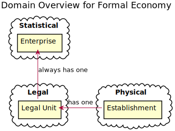
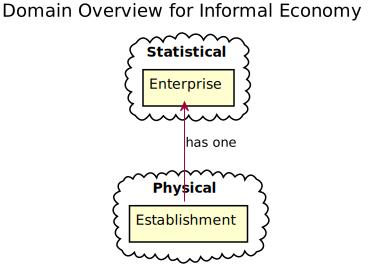

# STATBUS Domain Models

## Overview

STATBUS organizes data into distinct domains based on what we **observe** versus what we **derive/label**:

| Domain | Nature | Temporal? | Example |
|--------|--------|-----------|---------|
| **Legal** | Observed from registries, contracts | Yes | Legal Unit, Legal Relationship |
| **Physical** | Observed in the real world | Yes | Establishment |
| **Statistical** | Derived artifact for statistics | No | Enterprise |
| **Political** | Derived from ownership structures | No | Power Group |

### Key Insight

**Temporal entities** (Legal Unit, Establishment, Legal Relationship) represent things we observe over time - they have `valid_from`, `valid_to`, and history.

**Non-temporal entities** (Enterprise, Power Group) are statistical/analytical artifacts that **emerge from** temporal observations. They don't have independent temporal existence - their "state at time T" is derived from the temporal entities that reference them.

## Formal Economy

### Relationships

- **Legal Unit → Enterprise**: Every LU belongs to exactly one EN (always)
- **Legal Relationship → Power Group**: Each controlling relationship (≥50%) belongs to a PG
- **Legal Relationship → Legal Unit**: Tracks ownership/control between LUs (`influencing_id` owns/controls `influenced_id`)
- **Establishment → Legal Unit**: Every ES belongs to exactly one LU

Note: Power group membership of a Legal Unit is derived through `legal_relationship` - an LU is in a power group if it participates in any relationship (as influencer or influenced) that has a `power_group_id`.

### Domain Details

**Legal Domain** (observed, temporal):
- `legal_unit` - A legally registered entity (company, organization)
- `legal_relationship` - Ownership/control relationship between two legal units
  - `influencing_id` → `influenced_id` (influencer owns/controls influenced)
  - `percentage` - ownership/control percentage (≥50% = controlling interest)
  - `power_group_id` - assigned by worker when relationship forms a controlling cluster

**Physical Domain** (observed, temporal):
- `establishment` - A physical location where economic activity occurs

**Statistical Domain** (derived, non-temporal):
- `enterprise` - The smallest combination of legal units that is an organizational unit producing goods or services

**Political Domain** (derived, non-temporal):
- `power_group` - A hierarchy of legal units connected by controlling ownership (≥50%)
- Power groups are **TIMELESS** - once created, they exist forever as a registry entry
- Active status is **derived** at query time from `legal_relationship.valid_range`
- The `power_group_id` lives on `legal_relationship`, not `legal_unit`

## Informal Economy

In the informal economy the establishment is directly assigned to an enterprise, because there
is lacking stable identifiers, such as a tax registration.

## Why This Matters

The domain model clarifies:

1. **What we observe**: Legal registrations, physical locations, ownership records (temporal)
2. **What we derive**: Statistical groupings, power hierarchies (non-temporal)
3. **Data integrity**: Temporal entities need history tracking; derived entities need consistency with their sources
4. **Query patterns**: Historical queries traverse temporal entities; current-state queries can use derived entities directly
