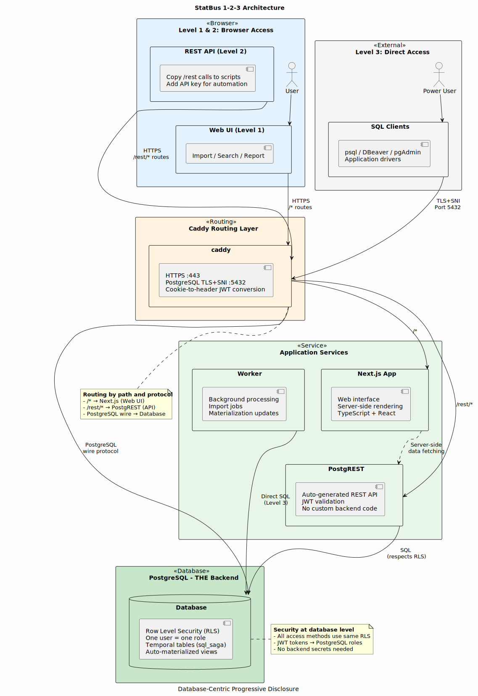
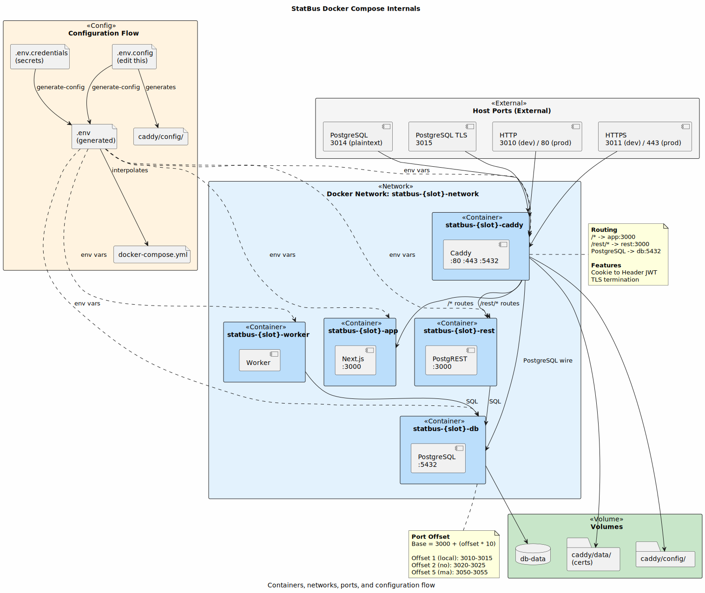

# Statbus Service Architecture

## Overview



Statbus is a **database-centric progressive disclosure architecture** - fundamentally different from traditional microservices or REST-backend architectures. The key insight: **the database IS the backend**, with security enforced at the database level (Row Level Security), allowing safe access via web, REST API, or direct PostgreSQL connections.

### The 1-2-3 Architecture Philosophy

**Why This Design?**

Traditional statistical software systems lock users into a specific interface (usually just web). As organizations grow and need more sophisticated analysis, they hit walls - the backend doesn't expose what they need, or the API is too restrictive.

StatBus solves this with progressive disclosure:

1. **Level 1: Simple Web Interface** - Start here. Top-level actions (IMPORT, VIEW/SEARCH, REPORT) cover 80% of needs. Power features hidden in command palette (cmd+k). All calls use `/rest` endpoints that are visible and copyable.

2. **Level 2: REST API Integration** - Copy those `/rest` calls from the browser into scripts (Python, R, JavaScript). Add an API key. Same security (PostgreSQL RLS still enforces access). Automate workflows, integrate with other systems.

3. **Level 3: Direct PostgreSQL** - Need full SQL power? Connect directly with psql, pgAdmin, DBeaver, or database drivers. Same security (RLS), same user credentials, zero backend abstraction. Full database capabilities available.

**Key Architectural Decisions:**

- **No custom backend code** - PostgREST auto-generates REST API from database schema
- **Security at database level** - Each user is a PostgreSQL role; Row Level Security enforces access regardless of connection method
- **Type safety from source** - Supabase tools export TypeScript types directly from schema, no manual sync needed
- **Transparent operations** - Web UI uses `/rest` so users can inspect and copy requests
- **Auto-materialization** - The `statistical_unit` table auto-updates when underlying data changes, providing a "slice and dice" view for all reporting

This is the opposite of microservices - it's a unified, database-centric architecture that avoids backend complexity entirely while scaling from simple web use to deep database integration.

## Service Components

Statbus is containerized with Docker Compose orchestrating multiple services.
Caddy serves as a routing layer and TLS termination point.



## Core Services

### 🗄️ Database (PostgreSQL) - THE Backend

- **Container**: `statbus-{slot}-db`
- **Purpose**: **This IS the backend** - all business logic, security, and data integrity lives here
- **Key Features**:
  - Custom PostgreSQL image with extensions (sql_saga, pgjwt, pg_graphql, etc.)
  - **Row Level Security (RLS)** - Security enforced at database level, works for ALL access methods
  - **One user = one role** - Each StatBus user is a separate PostgreSQL role with the same password
  - **Role-based access tiers**:
    - `admin_user` - Full control (setup, data, users)
    - `regular_user` - Data entry and editing, no configuration changes
    - `restricted_user` - Limited to specific regions or activity categories
    - `external_user` - Read-only access
  - **JWT-based authentication** - Database functions verify tokens and switch roles
  - **Temporal data with foreign keys** - Valid time tracking using sql_saga extension
  - **Auto-materialized views** - `statistical_unit` table auto-updates for slice/dice reporting

### 🔌 API Layer (PostgREST) - Level 2 Access

- **Container**: `statbus-{slot}-rest`
- **Purpose**: Auto-generates REST API from database schema - **zero custom backend code**
- **Key Features**:
  - Automatic REST API generation - reflects database schema instantly
  - JWT validation and role switching - integrates with PostgreSQL auth
  - Aggregation support for analytics
  - Exposes pg_graphql for GraphQL queries
  - **Type safety**: Database schema → TypeScript types (via Supabase tools)

### 🌐 Routing Layer (Caddy) - Traffic Director

- **Container**: `statbus-{slot}-caddy`
- **Purpose**: Routes traffic to appropriate service based on path; TLS termination for PostgreSQL
- **Key Features**:
  - Routes `/rest/*` → PostgREST (Level 2)
  - Routes `/` → Next.js App (Level 1)
  - Routes PostgreSQL wire protocol → Database (Level 3)
  - Cookie-to-header JWT conversion for PostgREST
  - Authentication flow coordination (login/refresh/logout/auth_status functions callable by anonymous)
  - **PostgreSQL Layer4 TLS+SNI Proxy** (PostgreSQL 17+ required):
    - Secure TLS-encrypted direct database access (Level 3)
    - SNI-based multi-tenant routing (one IP, many databases)
    - Supports psql, pgAdmin, DBeaver, and application drivers
  - Multiple deployment modes (development, private, standalone)

### 🖥️ Web Application (Next.js) - Level 1 Interface

- **Container**: `statbus-{slot}-app`
- **Purpose**: Simple, intentionally constrained web interface for common tasks
- **Key Features**:
  - TypeScript-based React application (App Router)
  - Server-side rendering for performance
  - **Top-level actions**: IMPORT, VIEW/SEARCH, REPORT (80% of use cases)
  - **Command palette (cmd+k)**: Esoteric features for power users
  - **Transparent REST calls**: All requests use `/rest` endpoints (visible, copyable to scripts)
  - Communicates with PostgREST via Caddy (same security as Level 2/3)

### ⚙️ Background Worker

- **Container**: `statbus-{slot}-worker`
- **Purpose**: Handles asynchronous data processing and analysis
- **Key Features**:
  - Built with Crystal (compiled, fast)
  - Direct database access (Level 3) for efficiency
  - Import job processing
  - Statistical analysis and materialization updates

## Authentication Flow

1. **Login**: User credentials sent to `/rest/rpc/login`, validated by PostgreSQL function
   and returns cookies with JWT tokens.
2. **Token Management**: JWT tokens stored in cookies (`statbus-{slot}` and `statbus-{slot}-refresh`)
3. **API Access**: Caddy extracts JWT from cookies and adds as Authorization headers for `/rest/*` routes,
   since [PostgREST does not support reading the JWT access token from a cookie](https://github.com/rest/rest/issues/3033)
4. **Token Refresh**: Automatic refresh via `/rest/rpc/refresh` endpoint that consumes the jwt refresh token,
   that can only be used once, and is found in the cookie, and returns a new access token and refresh token as cookies.
5. **Logout**: Reads tokens from cookies and clears them as well as removing the refresh token.

## Caddy Deployment Modes

The system supports three deployment modes for the Caddy service, controlled by the `CADDY_DEPLOYMENT_MODE` environment variable:

### 1. Development Mode
- **Purpose**: For local development with Next.js running separately
- **Features**:
  - API forwarding to PostgREST
  - Message for non-API requests (since Next.js runs locally)
  - HTTP only (no HTTPS)
- **Usage**: 
  ```bash
  # In .env.config
  CADDY_DEPLOYMENT_MODE=development
  ```
  ```bash
  ./devops/manage-statbus.sh start all_except_app
  ```

### 2. Private Mode
- **Purpose**: For deployment behind a public proxy
- **Features**:
  - Trusts headers from forwarding proxy
  - API forwarding to PostgREST
  - Other paths to Next.js app
  - HTTP only (HTTPS handled by public proxy). Consequently, HTTP/3 for client connections is also handled by the public-facing proxy (if it's configured for HTTP/3). The UDP port mapping for port 443 in `docker-compose.yml` for this Caddy service is primarily for 'standalone' mode where it handles TLS/HTTP/3 directly.
- **Usage**: 
  ```bash
  # In .env.config
  CADDY_DEPLOYMENT_MODE=private
  ```

### 3. Standalone Mode
- **Purpose**: For direct public access
- **Features**:
  - Handles HTTPS directly with automatic certificate management
  - API forwarding to PostgREST
  - Other paths to Next.js app
  - Includes public-facing configuration
- **Usage**: 
  ```bash
  # In .env.config
  CADDY_DEPLOYMENT_MODE=standalone
  ```

## PostgreSQL Access Architecture

Statbus provides secure direct PostgreSQL access through Caddy's Layer4 TLS+SNI proxy, enabling both web API access (via PostgREST) and direct database connections (via `psql` or database clients).

### Overview

- **Protocol**: PostgreSQL wire protocol over TLS with SNI (Server Name Indication)
- **Port**: Configurable via `CADDY_DB_PORT` (default: 3024 for development, 5432 for production)
- **Requirements**: PostgreSQL 17+ client with direct TLS negotiation support
- **Security**: TLS encryption with certificate-based authentication and SNI-based routing

### Architecture by Deployment Mode

#### Development Mode
```
psql client
    ↓ TLS connection to local.statbus.org:3024
    ↓ with SNI = local.statbus.org
    ↓ and ALPN = postgresql
    ↓
Caddy (development mode)
    ↓ Layer4 listener on :3024
    ↓ Matches TLS+SNI+ALPN (no postgres matcher - encrypted data)
    ↓ Terminates TLS (decrypts)
    ↓ Forwards plain TCP to db:5432 (Docker network)
    ↓
PostgreSQL container
    ✓ Receives plain TCP connection (no TLS needed)
```

**Key Configuration**:
- Domain: `local.statbus.org` (resolves to 127.0.0.1)
- Port: 3024 (or value from `CADDY_DB_PORT`)
- TLS: Caddy's internal CA (self-signed certificate)
- SSL Mode: `require` (encrypted but no cert verification)

#### Standalone Mode
```
psql client
    ↓ TLS connection to statbus.example.com:5432
    ↓ with SNI = statbus.example.com
    ↓ and ALPN = postgresql
    ↓
Caddy (standalone mode)
    ↓ Layer4 listener on :5432
    ↓ Matches TLS+SNI+ALPN for this domain
    ↓ Terminates TLS with production certificate
    ↓ Forwards plain TCP to db:5432 (Docker network)
    ↓
PostgreSQL container
    ✓ Receives plain TCP connection
```

**Key Configuration**:
- Domain: Your production domain (from `SITE_DOMAIN`)
- Port: 5432 (standard PostgreSQL port)
- TLS: ACME/Let's Encrypt production certificate
- SSL Mode: `verify-full` (full certificate verification)

#### Public/Private Mode (Multi-Tenant)
```
psql client
    ↓ TLS connection to tenant.example.com:5432
    ↓ with SNI = tenant.example.com
    ↓ and ALPN = postgresql
    ↓
Host-level Caddy (public mode)
    ↓ Layer4 listener on public IP :5432
    ↓ Matches SNI using @pg_sni_{slot} matcher
    ↓ Routes based on domain to correct tenant
    ↓ Terminates TLS (decrypts)
    ↓ Forwards plain TCP to 127.0.0.1:{CADDY_DB_PORT}
    ↓
Installation Caddy (private mode)
    ↓ Layer4 listener on 127.0.0.1:{CADDY_DB_PORT}
    ↓ No matchers needed (already authenticated)
    ↓ Forwards to db:5432 (Docker network)
    ↓
PostgreSQL container
    ✓ Receives plain TCP connection
```

**Key Configuration**:
- **Public Caddy**: Handles TLS termination and SNI-based tenant routing
- **Private Caddy**: Forwards decrypted connections from host to Docker network
- Each tenant gets unique `CADDY_DB_PORT` (e.g., 3024, 3034, 3044)
- Host-level Caddy imports `public-layer4-tcp-5432-route.caddyfile` from each installation

### Connection Requirements

**PostgreSQL 17+ Client Parameters**:
- `PGSSLNEGOTIATION=direct` - Use modern direct TLS (not legacy STARTTLS)
- `PGSSLSNI=1` - Send hostname as SNI (critical for multi-tenant routing)
- `PGSSLMODE=require|verify-full` - Encryption level (`require` for dev, `verify-full` for prod)

**Why No `postgres` Matcher?**

The Layer4 configuration uses TLS+SNI+ALPN matching but **not** the `postgres` protocol matcher because:
1. With `PGSSLNEGOTIATION=direct`, clients initiate TLS immediately
2. PostgreSQL protocol data is encrypted inside TLS
3. The `postgres` matcher cannot inspect encrypted data
4. TLS SNI and ALPN provide sufficient routing information

### Local psql Access

**Development Mode**:
```bash
./devops/manage-statbus.sh psql
```

**Production/Private Mode** (from server):
```bash
# Set environment variables
export PGHOST=127.0.0.1
export PGPORT=3024  # Or your CADDY_DB_PORT
export PGDATABASE=statbus
export PGUSER=your_username
export PGPASSWORD=your_password
export PGSSLNEGOTIATION=direct
export PGSSLMODE=require
export PGSSLSNI=1

# Connect
psql
```

### Benefits

✅ **Secure**: TLS encryption for all PostgreSQL connections
✅ **Multi-tenant**: SNI-based routing allows multiple databases on one IP
✅ **Simple**: PostgreSQL doesn't need TLS configuration
✅ **Standard**: Uses industry-standard TLS (no custom protocols)
✅ **Flexible**: Supports psql, pgAdmin, and application connections
✅ **Scalable**: Host-level Caddy can route to unlimited installations

## Environment Configuration

The application uses a layered approach to environment configuration:

1. **Base Configuration Files**:
   - `.env.credentials`: Contains stable credentials (passwords, secrets) - Generated once per deployment.
   - `.env.config`: Contains deployment-specific configuration - Generated and adjusted for deployment code and domain.
   - `.env`: Generated from the above files, by manage.cr, used by both Docker Compose and local development.
   - `caddy/config/Caddyfile`: The main Caddy configuration file used by the Caddy service. It imports one of the mode-specific files below based on `CADDY_DEPLOYMENT_MODE`.
   - `caddy/config/development.caddyfile`: Imported by `Caddyfile` for local development (HTTP only, API forwarding, CORS).
   - `caddy/config/private.caddyfile`: Imported by `Caddyfile` for deployment on a server behind a host Caddy that handles HTTPS and public routing (HTTP only within the container).
   - `caddy/config/public.caddyfile`: Designed for inclusion in a separate, host-wide Caddy installation that serves multiple Statbus deployments (handles HTTPS and public routing for a specific deployment).
   - `caddy/config/standalone.caddyfile`: Imported by `Caddyfile` for standalone server deployments where this Caddy instance handles HTTPS and public routing directly.

2. **Key Configuration Variables** (Edit in `.env.config`):
   - `DEPLOYMENT_SLOT_NAME`: Human-readable name
   - `DEPLOYMENT_SLOT_CODE`: Code used in URLs and container names
   - `CADDY_DEPLOYMENT_MODE`: Controls how Caddy operates (development, private, standalone)
   - `SITE_DOMAIN`: Domain for the publicly available site (required and used in standalone mode, as well as in the public.caddyfile)

3. **Docker Compose vs Local Development**:
   - When running in Docker: Environment variables are hard-coded in `docker-compose.app.yml`
   - When running locally: Environment variables are read from the project `.env` file.

### Docker Compose Profiles

The system uses Docker Compose profiles to control which services start:

- `all`: All services (database, API, app, worker)
- `all_except_app`: All backend services without the Next.js app (for local development)

### Local Development Setup

For local Next.js development:

1. **Start Backend Services in Development Mode**:
   ```bash
   ./devops/manage-statbus.sh start all_except_app
   ```

2. **Run Next.js Locally**:
   ```bash
   cd app
   pnpm run dev
   ```

3. **Development Environment**:
   - In `.env.config`, set `CADDY_DEPLOYMENT_MODE=development`. Run `./devops/manage-statbus.sh generate-config` to create/update `.env`.
     - This sets `NEXT_PUBLIC_BROWSER_REST_URL` in `.env` to Caddy's host-accessible URL (e.g., `http://localhost:3010`).
     - It also sets `NODE_ENV=development` in `.env`, which is then used by the `statbus-{slot}-app` container.
   - The local Next.js app (started with `cd app && pnpm run dev` on your host machine) typically runs on `http://localhost:3000`. `NODE_ENV` for this process is usually `development` (set by Next.js CLI), and `RUNNING_IN_DOCKER` is not set.
   - **API Request Flow (True Local Development - `pnpm run dev` on host):**
     - Client-side JS (browser accessing `http://localhost:3000`) makes API calls to `http://localhost:3000/rest/...`. This is because `app/next.config.js` (when `NODE_ENV=development` and not `RUNNING_IN_DOCKER`) overrides `NEXT_PUBLIC_BROWSER_REST_URL` for the client build.
     - The Next.js dev server (at `http://localhost:3000`) proxies these `/rest/*` requests to Caddy (e.g., `http://localhost:3010/rest/...`) using its `rewrites` config.
     - Caddy (listening on `3010`) processes the request, handles auth cookie conversion, and proxies to PostgREST.
   - **API Request Flow (Dockerized Development - `docker compose up` with `dev` slot, browser accessing `http://localhost:3010`):**
     - `NODE_ENV=development` and `RUNNING_IN_DOCKER=true` are set in the app container's environment.
     - `app/next.config.js` detects this state. It does *not* override `NEXT_PUBLIC_BROWSER_REST_URL` for the client build and does *not* set up Next.js server rewrites.
     - Client-side JS (browser accessing `http://localhost:3010`, served by Caddy via `app:3000`) makes API calls using `NEXT_PUBLIC_BROWSER_REST_URL` from `.env` (e.g., `http://localhost:3010/rest/...`).
     - These requests go directly to Caddy (`localhost:3010`). Caddy's `route /rest/*` block handles them, converts auth cookies, and proxies to PostgREST.
     - The Next.js app container (`app:3000`) is only involved in serving the application pages/assets, not in proxying these client-side API calls.
   - **API Request Flow (Production/Private - `docker compose up` with `standalone` or `private` slot):**
     - `NODE_ENV=production` and `RUNNING_IN_DOCKER=true` are set in the app container.
     - Similar to Dockerized Development, `app/next.config.js` ensures client-side API calls use `NEXT_PUBLIC_BROWSER_REST_URL` from `.env` (e.g., `https://your.domain/rest/...` or `http://localhost:<caddy_port>/rest/...`), which points to Caddy. Caddy handles the API routing.
   - This multi-layered setup ensures correct API routing and client-side configuration across different development and deployment scenarios.

### Environment Variable Flow

1.  **For Docker Deployment (any slot/mode via `docker compose`):**
    ```
    .env.credentials + .env.config
        -(manage.cr generate-config)→ .env (contains dynamic NODE_ENV)
            → docker-compose.*.yml (uses ${NODE_ENV})
                → container environment (app container gets NODE_ENV from .env)
                    → app/next.config.js (detects NODE_ENV and RUNNING_IN_DOCKER=true)
    ```

2.  **For True Local Development (`pnpm run dev` on host):**
    ```
    .env.credentials + .env.config
        -(manage.cr generate-config)→ .env (NEXT_PUBLIC_BROWSER_REST_URL points to Caddy)
            → app/next.config.js (reads .env, detects NODE_ENV=development from CLI & RUNNING_IN_DOCKER=false)
                → Next.js dev server environment (overrides client NEXT_PUBLIC_BROWSER_REST_URL, sets up rewrites to Caddy)
    ```

This approach ensures consistent configuration between Docker and local development environments
while allowing for the flexibility of running the Next.js app locally for faster development cycles.

## Deployment Configuration

The system supports multiple deployment slots for different countries (ma(rocco),no(rway),jo(rdan),...) through environment variables:

- `DEPLOYMENT_SLOT_NAME`: Human-readable name
- `DEPLOYMENT_SLOT_CODE`: Code used in URLs and container names
- `NEXT_PUBLIC_DEPLOYMENT_SLOT_CODE`: Exposed to browser.
- `NEXT_PUBLIC_DEPLOYMENT_SLOT_NAME`: Exposed to browser.
- `DEPLOYMENT_SLOT_PORT_OFFSET`: Used to generate the ports used and avoid conflicts between multiple instances on the same host. Default is 1 meaning an offset of 10.
- `SITE_DOMAIN`: Generated as localhost:x and cahnged manually for deployment.

Each deployment uses the same architecture but with isolated databases and configuration.

