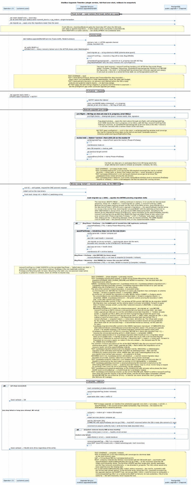
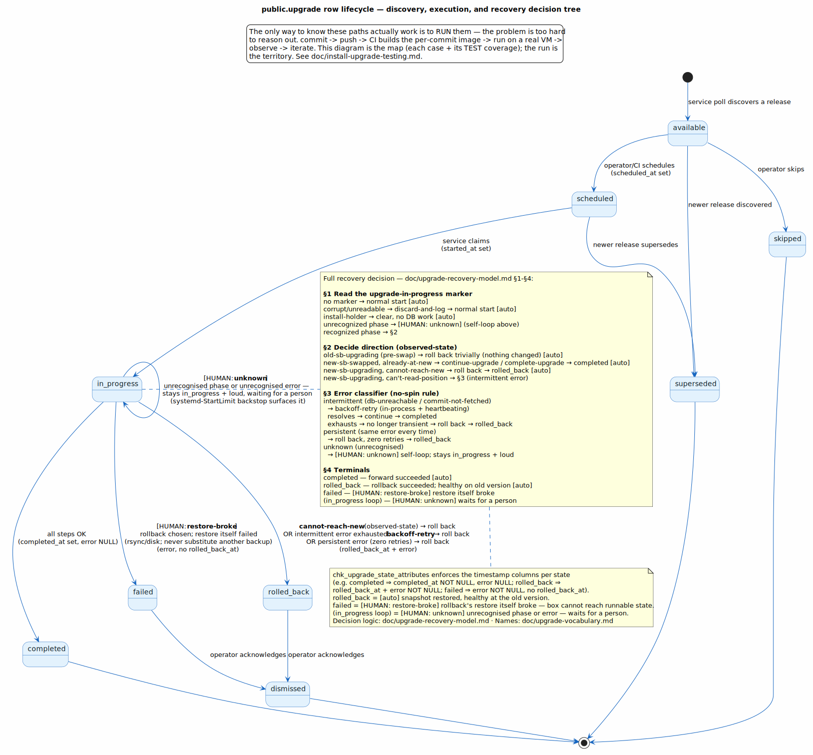
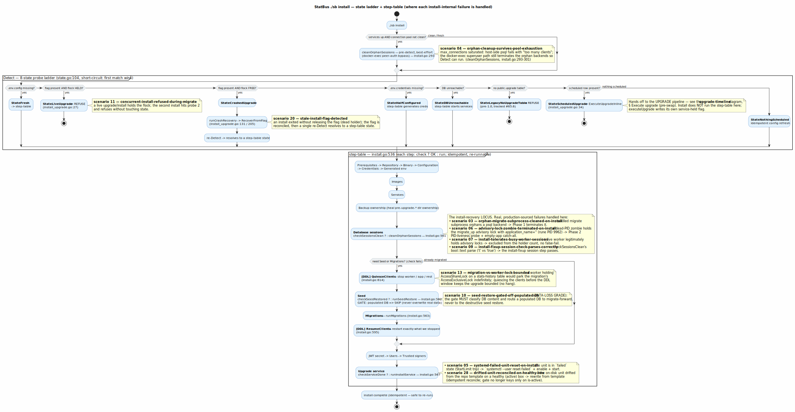

# Upgrade Timeline

The single authoritative reference for how StatBus upgrades itself: the end-to-end
timeline, the `public.upgrade` row lifecycle, the install ↔ service mutex, and the
fail-fast recovery contract.

Three orchestration paths exist and must never fight each other. The mutex contract
described here is enforced in code so that running a manual install while the service
is mid-upgrade fails loud with a diagnostic, rather than corrupting state.

The recovery model is **fail-fast, one-shot**: an upgrade runs exactly once; on any
step failure or hang it rolls back to the pre-upgrade snapshot, records a terminal
state, and posts to Slack. There is no retry and no separate liveness sidecar — one
systemd unit owns the whole lifecycle.

## Diagrams

**Test-coverage convention.** Both diagrams double as a visual test-coverage map: every
failure-injection point carries a pale-yellow note `TEST <scenario-slug> (<NN>): <the forward
invariant the scenario must prove>` — framed as the guarantee that must hold, not the failure.
A point with no scenario is marked `NO TEST (gap): <unproven invariant>`, so coverage holes are
visible at a glance. Slugs are `test/install-recovery/scenarios/` names.

### Sequence — the upgrade timeline

The `== … ==` bands are the **citable named phases**. Code comments cite them as
`see upgrade-timeline.md § <band>`; keep the band labels, the `##` headers in
[The five phases](#the-five-phases), and the diagram source in sync.



Source: [`diagrams/upgrade-timeline.plantuml`](diagrams/upgrade-timeline.plantuml). The
`.githooks/pre-commit` hook regenerates the SVG whenever the `.plantuml` source is
staged — there is no manual freshness stamp.

### State — the `public.upgrade` row lifecycle



Source: [`diagrams/upgrade-lifecycle.plantuml`](diagrams/upgrade-lifecycle.plantuml).

### Activity — the `./sb install` state ladder + recovery map

Where the sequence diagram above owns the upgrade *timeline*, this activity diagram owns the
`./sb install` path — the 8-state probe ladder, the dispatch, and the point at which each
install-internal failure is detected and recovered. Detailed in
[Install state ladder](#install-state-ladder).



Source: [`diagrams/install-recovery.plantuml`](diagrams/install-recovery.plantuml).

## The five phases

These match the `== … ==` bands in the sequence diagram one-to-one. The names are
stable so other code and docs can cite a precise section.

### Service boot

systemd starts the single user unit `statbus-upgrade@$USER.service` (`Type=notify`).
The boot order is: **cheap, bounded init** (`EnsureDBUp` → connect → advisory lock →
`LISTEN`) → `sd_notify READY=1` → **boot `migrate up`** (the schema-skew guard,
service.go:1644) → `recoverFromFlag` (reconciling any flag left behind by a crashed
prior attempt — see [Recovery contract](#recovery-contract--fail-fast-one-shot)) →
the main loop. The DB-size-scaled work (boot `migrate up`, and any exit-42 resume)
therefore runs in the **active phase** under `WatchdogSec`, never in the
`TimeoutStartSec` window, so a large database can never blow the static start budget.
Because the watchdog is armed from `READY=1` and the main-loop idle heartbeat does not
exist yet, boot `migrate up` carries its **own always-ping `WATCHDOG=1` ticker** for
the subprocess duration, bounded by the shared 30-min `MigrateUpTimeout`
(STATBUS-012) — and note that after the unconditional post-swap handoff (below) this
boot migrate is the step that applies **every upgrade's migration delta**, not a rare
guard. The advisory lock guarantees a single live
service per slot. On **failure** of the boot `migrate up` guard *with a service-held
in-progress flag present*, the guard **defers** to `recoverFromFlag` (the snapshot-restore
owner) rather than refusing — so a half-applied migration that can't be re-applied
(after-commit "relation already exists", or a deterministic migration error) restores to
`rolled_back` instead of boot-looping (STATBUS-017). It still refuses for the no-flag /
install-held case, a genuine stale-schema refusal with no recovery owner.

### Schedule + dispatch

An operator or CI run schedules an upgrade: `./sb upgrade apply-latest` (or
`schedule <version>`) writes `public.upgrade` to `state='scheduled'` and fires a
`NOTIFY` on the upgrade channel. GitHub Actions `deploy-to-<slot>.yaml` workflows take
this path remotely; they never call `./sb install` directly. The listening service
wakes and **claims** the row atomically:
`UPDATE … WHERE state='scheduled' AND started_at IS NULL → in_progress`. If a racing
service or concurrent install wins first, the loser sees `RowsAffected = 0` and bails
with a clear diagnostic.

### Execute upgrade (pre-swap)

The pre-swap half of the pipeline, run on the old binary with the mutex held (the service
writes its own `Holder="service"` flag first — see [Flag-file mutex](#flag-file-mutex-install--service)).
The binary swap + `exit 42` is the **pivot** (step 6): everything after it runs on the
**new** binary (see [Binary-swap restart + resume](#binary-swap-restart--resume)).

1. Pre-flight checks: downgrade guard, release-assets manifest, disk space, commit signature.
2. **writeUpgradeFlag** — `acquireFlock` opens the marker `O_CREATE|O_RDWR` and takes a
   non-blocking `flock(LOCK_EX|LOCK_NB)`; the mutex (the kernel lock on the held fd) is now held.
3. Maintenance mode on (the web UI shows "upgrading").
4. Stop application services; **take the DB snapshot** (recorded as `backup_path`).
5. `git checkout` the target commit.
6. **Binary swap (the pivot)** — `replaceBinaryOnDisk` swaps `./sb`, the flag advances to
   `Phase=PostSwap`, and the service `exit 42`s → systemd respawns it on the **new binary**.

**Fail-fast.** Any step (pre- or post-swap) from the snapshot (4) onward that errors *or
hangs* aborts the single attempt and routes to [Complete / rollback](#complete--rollback).
The attempt is never retried.

### Binary-swap restart + resume

The pivot above (`exit 42`) makes systemd respawn the service **on the new binary** — the
unit declares `SuccessExitStatus=42` + `RestartForceExitStatus=42` — this is the **one
planned restart** of an upgrade. The fresh process **boots fresh through the full
[Service boot](#service-boot) sequence**: cheap init → `READY=1` → **boot `migrate up`,
which applies the entire pending migration delta right here** (repo is already at the
new version from the pre-swap checkout; the always-ping watchdog ticker +
`MigrateUpTimeout` cover it — STATBUS-012) → `recoverFromFlag`, which sees the
`Phase=PostSwap` flag (the planned handoff), stamps `Phase=Resuming`, and continues the
*same* attempt via `resumePostSwap` → `applyPostSwap`. The remaining steps all run on the
new binary:

7. `./sb config generate`.
8. `docker compose pull` the new images.
9. Start the database; wait for health.
10. Reconnect to the database.
11. `./sb migrate up --verbose` — **normally a no-op** (the boot migrate above already
    brought the schema to HEAD); this is the bounded retry executor for the case where
    the boot migrate failed and fell through to the resume (STATBUS-017 path).
12. Start application services; wait for health.
13. Post-upgrade install fixup: `runInstallFixup` runs `./sb install --non-interactive
    --inside-active-upgrade` with `STATBUS_INSIDE_ACTIVE_UPGRADE=1`. The bypass signals
    are necessary because our flag is still on disk; without them the child install
    would abort with "upgrade in progress".
14. Mark `completed_at`; **removeUpgradeFlag** (mutex released); supersede older `available`
    rows; notify the UI; archive the snapshot.

The restart is expected exactly once. Any **other** restart while a row is `in_progress`
(watchdog kill, OOM, operator `systemctl restart`) leaves `Phase=Resuming`, so
`recoverFromFlag` treats the attempt as **died** → roll back to the snapshot. There is no
"resume forward from an arbitrary crash point" mode.

### Complete / rollback

- **Success:** mark `completed_at` (`state=completed`), remove the flag, supersede older
  rows, notify the UI, post the Slack "OK" callback.
- **Failure (one attempt, no retry):** `rollback()` restores git state, the DB snapshot,
  and services, then records one of **two terminal tiers**:
  - `rolled_back` (`rolled_back_at` + `error`) — the snapshot restored cleanly; the
    server is **healthy at the old version**.
  - `failed` (`error`, no `rolled_back_at`) — the restore **also failed**; the server
    needs **hands-on recovery**.

  The flag is removed and a Slack "FAILED" callback carries the exact failing step and
  reason. See [Recovery contract](#recovery-contract--fail-fast-one-shot).

## Upgrade-row lifecycle (the states)

`public.upgrade.state` is the `upgrade_state` enum; it is the authoritative lifecycle
record — code writes it explicitly on every transition. The
`chk_upgrade_state_attributes` CHECK constraint validates that the timestamp columns
match the declared state (illegal combinations are rejected at the DB layer), and two
partial-unique indexes (`upgrade_single_scheduled`, `upgrade_single_in_progress`) enforce
at most one row in each of those states. Authoritative column reference:
[`doc/db/table/public_upgrade.md`](db/table/public_upgrade.md).

| State | Meaning | Key timestamp invariant |
|---|---|---|
| `available` | Discovered by the service poll; not yet acted on. | all lifecycle timestamps NULL |
| `scheduled` | Queued for upgrade. | `scheduled_at` set, `started_at` NULL |
| `in_progress` | Claimed; the pipeline is running. | `started_at` set, `completed_at`/`rolled_back_at` NULL |
| `completed` | Upgrade landed. | `completed_at` set, `error` NULL |
| `rolled_back` | Forward failed → snapshot restored; healthy at old version. | `rolled_back_at` + `error` set |
| `failed` | Forward failed **and** restore also failed; needs hands-on. | `error` set, `completed_at`/`rolled_back_at` NULL |
| `skipped` | Operator chose not to apply an available upgrade. | `skipped_at` set |
| `superseded` | A newer release replaced this one before it ran. | `superseded_at` set |
| `dismissed` | Operator acknowledged a `failed`/`rolled_back` row. | `dismissed_at` set |

The spine the upgrade pipeline drives is `scheduled → in_progress → {completed |
rolled_back | failed}`; the other states are discovery/housekeeping (`available`,
`skipped`, `superseded`) and post-terminal operator acknowledgement (`dismissed`).

## Three orchestration paths

| Path | Entry point | Owns | Respects | When to use |
|---|---|---|---|---|
| **Service** (automatic) | `./sb upgrade service` running as systemd user unit `statbus-upgrade@$USER.service` | End-to-end upgrade lifecycle: discover → schedule → execute → recover | Its own advisory lock, the shared **flock** mutex flag | Production norm. Discovers and applies releases on a poll cycle or on `NOTIFY`. |
| **Unified install** | `./sb install` | Single operator entrypoint — probes state and dispatches: fresh → step-table; scheduled row pending → `executeUpgrade` inline; crashed flag → recover + re-detect; live upgrade → refuse; pre-1.0 → refuse. | The shared **flock** mutex flag — step-table path acquires as `Holder="install"`, inline-upgrade path lets `executeUpgrade` write its own `Holder="service"` flag. | First-time install, repair, or dispatching a pending upgrade without waiting for the service tick. |
| **Cloud tool** | `./cloud.sh install <server>` | Fleet-level remote install: SSH + stop_and_unwedge + run `./sb install` + ensure_service_started | Its own fleet semantics; defers to the shared mutex for per-host safety | Operator updating a remote host from their own machine. |

GitHub Actions workflows (`deploy-to-<slot>.yaml`) trigger the **service** path — they run
`./sb upgrade apply-latest` remotely, which sends a `NOTIFY` the service picks up. Actions
never call `./sb install` directly.

## Install state ladder

`./sb install` runs `install.Detect` (`cli/internal/install/state.go`) once and dispatches
on the result. The 8 states are an ordered top-down ladder.

Unlike the upgrade *timeline* (a sequence), the install path is a **state classifier + an
idempotent step sequence** — its honest shape is an activity diagram. The diagram below shows
the probe ladder, the dispatch, and **where each install-internal failure is detected and
recovered** (the `partition` blocks are its citable phases, the analogue of the sequence
diagram's `==` bands):


Source: [`diagrams/install-recovery.plantuml`](diagrams/install-recovery.plantuml). Regenerated
by the same `.githooks/pre-commit` hook as the other diagrams.

The **Proven by** column closes the ladder↔scenario loop — `test/install-recovery/scenarios/`.
A `—` marks a real, reachable state with **no dedicated scenario** (a coverage gap):

| # | State | Probe signal | Dispatch | Proven by |
|---|---|---|---|---|
| 1 | `StateFresh` | no `.env.config` | step-table (set up a clean install) | `0-happy-install` |
| 2 | `StateLiveUpgrade` | flag present, holder PID alive | refuse with diagnostic — point at `journalctl` | `1-boot-concurrent-install` |
| 3 | `StateCrashedUpgrade` | flag present, holder PID dead | `RecoverFromFlag` → re-`Detect` → re-dispatch | `1-boot-flag-stale-handoff`, `08` (next-install recovery) |
| 4 | `StateHalfConfigured` | `.env.config` present, `.env.credentials` missing | step-table | — (gap) |
| 5 | `StateDBUnreachable` | creds present, DB not reachable | step-table (brings services up) | — (gap) |
| 6 | `StateLegacyNoUpgradeTable` | DB up, no `public.upgrade` table | refuse — pre-1.0 install, manual path in `doc/CLOUD.md` | — (gap) |
| 7 | `StateScheduledUpgrade` | pending row (`state='scheduled'`, `started_at IS NULL`) | `executeUpgrade` inline via `upgrade.Service.ExecuteUpgradeInline` | — (inline path; service path: `0-happy-upgrade`) |
| 8 | `StateNothingScheduled` | no pending row; everything else healthy | step-table (idempotent config-refresh checkpoint) | `5-install-drifted-unit-reconciled` |

The install-internal failures are recovered inside the **step-table** (and the pre-detect cleanup),
not at a ladder state. Their scenario coverage (closing the rest of the loop):

| Recovery point (`cli/cmd/install.go`) | Failure handled | Proven by |
|---|---|---|
| pre-detect `cleanOrphanSessions` (:293) | pool exhausted; docker-exec peer-auth bypass | `5-install-stage-b-pool-exhaustion` |
| `Database sessions` step (:561) | orphan psql backend from a killed migrate subprocess | `5-install-stage-a-killed-migrate` |
| `Database sessions` step (:561) | dead-PID zombie holding the migrate_up advisory lock, empty `application_name` (rune PID 9962) | `5-install-stage-d-advisory-zombie` |
| `Database sessions` step (:561) | live worker legitimately holding advisory locks — no false-fail | `5-install-stage-e-worker-busy` |
| `Database sessions` step (:561) | `checkSessionsClean` bool::text parse (`'t'` vs `'true'`) | `5-install-bool-text-regression` |
| `[DDL] QuiesceClients` (:614) | worker `AccessShareLock` vs migration `AccessExclusiveLock` — bounded, no hang | `3-postswap-worker-ddl-deadlock` |
| `Seed` gate (:562) | populated DB must route to migrate-forward, never destructive seed-restore | `5-install-seed-on-populated` (data-loss grade) |
| `Upgrade service` step (:567) | unit in `failed` state (StartLimit trip) → `reset-failed` + enable + start | `5-install-stage-c-systemd-failed` |
| `Upgrade service` step (:567) | drifted on-disk unit on a healthy box → rewrite from template | `5-install-drifted-unit-reconciled` |

The inline dispatch for state 7 claims the scheduled row atomically (`UPDATE … WHERE
state='scheduled' AND started_at IS NULL`) — a racing service or concurrent install that
wins first leaves the loser with `RowsAffected = 0`, which bails cleanly. After a
successful inline upgrade, if the systemd upgrade unit is active, install restarts it so
the long-running service picks up the new binary and migrations.

## Fresh-install seed restore

A genuinely fresh box does not replay every migration from zero. It restores a
pre-migrated `pg_dump` **seed**, then applies only the migrations newer than the seed.
The seed is created as a developer/CI activity and shipped as the commit-tagged image
`ghcr.io/statisticsnorway/statbus-seed:<commit_short>`; the full creation lifecycle and
the `seed.json` field schema live in
[`doc/DEVELOPMENT.md` § Database seed](DEVELOPMENT.md#database-seed).

The restore is the **Seed step** of the `./sb install` step-table
(`cli/cmd/install.go:562`) — the same step-table every install path runs (fresh → state 1,
idempotent refresh → state 8, and the post-swap install fixup the upgrade service runs
**under systemd**, step 13 of [Execute upgrade](#binary-swap-restart--resume)). Runtime
order on a fresh box:

1. **Gate** — `checkSeedRestored` (`cli/cmd/install.go:1412`) runs the Seed step **only**
   against a genuinely fresh DB: no user data **and** no applied migrations. A populated DB
   short-circuits via `dbHasUserData` (`cli/cmd/install.go:1427`), so a seed restore can
   never overwrite real data. This same gate is what makes the step a safe no-op when the
   systemd upgrade service runs the install fixup against an already-populated DB.
2. **Fetch** — `./sb db seed fetch` resolves `commit_short` (from `.env`'s `COMMIT_SHORT`,
   else `git rev-parse --short=8`) and pulls `statbus-seed:<commit_short>`, extracting
   `/seed.pg_dump` + `/seed.json` with `docker create` + `docker cp` — the image is never
   run (`cli/cmd/seed.go:159`).
3. **Restore** — `./sb db seed restore` runs `pg_restore --clean --if-exists --no-owner
   --disable-triggers --single-transaction` (`cli/cmd/seed.go:237`). `--single-transaction`
   makes it all-or-nothing — there is no "warnings but data restored" outcome — and
   `runPgRestoreAtomic` fails the install loudly if a future change ever drops the flag
   (`cli/cmd/seed.go:246`). The restore brings in the `db.migration` rows recorded at
   seed-creation time (the `migration_version` in `seed.json`).
4. **Migrate the delta** — the **Migrations step** (`cli/cmd/install.go:563`) runs
   `migrate up`, which reads the just-restored `db.migration` via `listAppliedVersions`
   (`cli/internal/migrate/migrate.go:487`) and applies only versions newer than the seed
   (`cli/internal/migrate/migrate.go:740`), then re-runs `post_restore.sql`
   (`cli/internal/migrate/migrate.go:912`).
5. **Normal service** — the remaining install steps (JWT, users, signers, upgrade service)
   run, and the box enters its normal lifecycle at [Service boot](#service-boot).

The Seed step is non-fatal: if no image is published for the commit, or the daemon is down,
`runSeedRestore` falls through (`cli/cmd/install.go:1495`) and the Migrations step replays
every migration from zero — slower, identical end state.

## Flag-file mutex (install ↔ service)

### What the mutex protects against

The upgrade service and `./sb install` both mutate the same things — the `./sb` binary
file, the git working tree in `~/statbus/`, the `public.upgrade` table, and the DB schema
via migrations. Running both concurrently would interleave these mutations unpredictably.
The mutex ensures at most one orchestrated actor mutates state at a time.

### The primitive: `~/statbus/tmp/upgrade-in-progress.json` + a kernel flock

Both the service (`writeUpgradeFlag`) and `./sb install` (`AcquireInstallFlag`) acquire the
marker through the same `acquireFlock` (`cli/internal/upgrade/service.go`): open
`O_CREATE|O_RDWR`, take a non-blocking **`flock(LOCK_EX|LOCK_NB)`** on the open fd, then
truncate and write the holder's metadata. The mutex is the **kernel advisory lock on the
fd**, not the file's existence.

This makes stale locks impossible: the holder keeps the fd open for the full duration, and
on any exit — graceful, crash, or `SIGKILL` — the kernel closes the fd and **auto-releases
the lock**. The file *content* persists on disk (it lives outside the DB volume, so a
rollback doesn't erase it) only so the next acquirer can read the prior holder's metadata,
reconcile, then truncate and write its own. File presence therefore means "a holder is live
(flock held) **or** a holder crashed leaving content to reconcile (flock free)"; liveness is
decided by **trying the flock**, never by the file existing. The `Holder` field records
which actor owns it.

On contention the second `flock(LOCK_EX|LOCK_NB)` returns **`EWOULDBLOCK`** immediately — it
does not block and does not deadlock. The caller reads the on-disk metadata to name the live
holder in a diagnostic. `PID`/`pidAlive(PID)` are **diagnostic only** (which message to
print), not the liveness source of truth.

### Flag schema (`UpgradeFlag` in `cli/internal/upgrade/service.go`)

```go
type UpgradeFlag struct {
    ID          int       `json:"id"`           // public.upgrade.id (0 when Holder=="install")
    CommitSHA   string    `json:"commit_sha"`   // target commit ("" when Holder=="install")
    CommitTags  []string  `json:"commit_tags,omitempty"` // release tags at CommitSHA; empty for install-held or untagged
    PID         int       `json:"pid"`          // os.Getpid() at write
    StartedAt   time.Time `json:"started_at"`
    InvokedBy   string    `json:"invoked_by"`   // e.g. "scheduled", "operator:jhf"
    Trigger     string    `json:"trigger"`      // coarse bucket for logs
    Holder      string    `json:"holder"`       // "service" or "install"
    Phase       string    `json:"phase,omitempty"`       // "" PreSwap | "post_swap" | "resuming" — the recovery discriminator
    Recreate    bool      `json:"recreate,omitempty"`    // replay --recreate on resume
    BackupPath  string    `json:"backup_path,omitempty"` // finalized snapshot dir; restored by the Resuming rollback
}
```

The `Phase` field is the monotonic recovery ladder (PreSwap → PostSwap → Resuming), each
rung consumed exactly once — see [Recovery contract](#recovery-contract--fail-fast-one-shot).

### Holders and ownership handoff

Two holders, distinguished by the `Holder` field:

- `Holder="install"` — written by `acquireOrBypass` when install runs the step-table.
  Released by `defer ReleaseInstallFlag` on any exit. `ID=0`, `CommitSHA=""` (install
  writes no `public.upgrade` row).
- `Holder="service"` — written by `writeUpgradeFlag` inside `executeUpgrade`, regardless
  of who invoked it.

When `./sb install` routes to the **scheduled-upgrade** dispatch (state 7), it does **not**
acquire the install-held flag. `executeUpgrade` writes its own service-held flag internally
before any destructive step. Ownership of the mutex transfers cleanly across the boundary
via this filesystem-level handshake. **Do not** wrap `svc.ExecuteUpgradeInline` with an
install-flag acquire — the install already holds the flock, so `executeUpgrade`'s own
`acquireFlock` would fail with `EWOULDBLOCK` (a second exclusive flock via a new fd on a
file the process already locks is denied). Let `executeUpgrade` write its own
`Holder="service"` flag instead. The step-table path and the inline-dispatch path are
mutually exclusive within a single `./sb install` run: either `acquireOrBypass` runs
(step-table) or it does not (inline).

### Decision tree at `./sb install` entry

`./sb install` first runs `install.Detect` (the ladder above). Dispatch then branches:

- **StateLiveUpgrade** (flag present, PID alive) → refuse without touching state; point at
  `journalctl --user -u 'statbus-upgrade@*' -f`.
- **StateCrashedUpgrade** (flag present, PID dead) → call `RecoverFromFlag` directly (no
  install-flag acquire), then re-`Detect` and re-dispatch. Recovery reads `Holder`:
  `"service"` reconciles the `public.upgrade` row, `"install"` just removes the file.
- **StateScheduledUpgrade** (pending row) → delegate to `upgrade.Service.ExecuteUpgradeInline`.
  Install does **not** acquire the flag itself; `executeUpgrade` writes its own
  `Holder="service"` flag internally.
- **All other states** (Fresh, HalfConfigured, DBUnreachable, NothingScheduled) → run
  `acquireOrBypass`, then the step-table:

```
Bypass signal set (--inside-active-upgrade or env var)?
│
├── Yes → Verify-only. The upgrade service spawned us as runInstallFixup;
│         the parent already holds the flag. Log "bypass honored, PID X,
│         holder=Y, invoked_by=Z" and proceed without acquiring.
│
└── No → AcquireInstallFlag (via acquireFlock — O_CREATE|O_RDWR + flock(LOCK_EX|LOCK_NB)).
        │
        ├── Success → Proceed; defer ReleaseInstallFlag (removes the file
        │             iff our PID still owns it as Holder="install").
        │
        └── EWOULDBLOCK (flock held by a live holder) → Read the existing flag for diagnostics:
            │
            ├── Live PID, Holder=="service" → "Upgrade in progress: PID X
            │       is running. Wait for it to complete:
            │         journalctl --user -u 'statbus-upgrade@*' -f"
            │
            ├── Live PID, Holder=="install" → "Another ./sb install is
            │       already running: PID X. Wait for it to complete."
            │
            └── Dead PID (any holder) → unreachable from acquireOrBypass.
                    install.Detect returns StateCrashedUpgrade first;
                    RecoverFromFlag reconciles the flag before dispatch.
```

Key invariant: exactly one actor ever holds the flag.

### Cleanup paths (all must remove the flag)

| Path | Location |
|---|---|
| Normal completion | `executeUpgrade` end, `service.go` |
| Rollback on failure | end of `rollback()`, `service.go` |
| Direct failure (e.g., `pullImages`) | end of `failUpgrade()`, `service.go` |
| Self-update restart recovery | `recoverFromFlag`, `service.go` |
| Crash recovery | `recoverFromFlag`, `service.go` |
| `completeInProgressUpgrade` | `service.go` |
| Install-holder release | `ReleaseInstallFlag`, `service.go` (deferred from `runInstall`) |

If any new code path writes the flag, it MUST also remove it on all exit paths.

### Bypass signals — use with care

Two signals exist; either triggers the bypass: the CLI flag `--inside-active-upgrade`
(hidden from `--help`) and the env var `STATBUS_INSIDE_ACTIVE_UPGRADE=1`. **Only one
caller sets these: `runInstallFixup` in `cli/internal/upgrade/exec.go`**, called from
`executeUpgrade` during the post-migration install step. It sets both redundantly — the
flag for audit visibility in `ps`/logs, the env var for robustness through exec chains.
Operators must never set them; an operator who thinks they need to bypass the mutex is
almost certainly facing a stale flag from a crash and should follow the abort message.

### Legacy flag files

Flag files written before Release 1 lack `PID`/`StartedAt`; unmarshal gives `PID=0`, and
`pidAlive(0)` returns false by design (the `pid <= 0` guard), so legacy flags are correctly
diagnosed as "crashed — recovery required". Flag files written before Release 1.1 lack
`Holder`; the empty default is treated as `"service"` everywhere it matters.

## Recovery contract — fail-fast, one-shot

There is exactly **one** recovery algorithm in production: **try forward once; on any step
failure or hang, restore from the pre-upgrade snapshot and record a terminal state.** No
mode parameter, no operator-facing `--recovery` flag, no retry loop, and no separate
liveness sidecar — a single systemd unit owns the lifecycle.

### `recoverFromFlag` (startup ground-truth)

Called once at service startup before the main loop, and by `./sb install`'s
crashed-upgrade dispatch (state 3). It reconciles any flag on disk:

1. **No flag** → Idle; proceed.
2. **Flag present, owning PID alive and not us** → pathological (the advisory lock should
   prevent two services; an install holder would be a surprise concurrent operator). Log
   an error, refuse to clean up, leave the flag for the operator.
3. **Flag present, PID dead, `Holder="install"`** → install crashed; there is no
   `public.upgrade` row to reconcile. Remove the flag.
4. **Flag present, PID dead, `Holder="service"`** (or empty legacy) → the service died
   mid-upgrade. The discriminator is the flag's **`Phase`** field — a monotonic ladder, each
   rung consumed exactly once — **not** a git-HEAD comparison:
   - **`Phase=PreSwap`** (`""` — the default, written before `replaceBinaryOnDisk`) → the
     attempt died **before** the binary-swap commit boundary. The DB volume is unchanged (the
     pre-upgrade backup is an rsync *out*; `pickLatestBackup` excludes the in-progress
     `pre-upgrade-syncing/` dir, so restore no-ops). **Roll back** — mark the row terminal,
     restart services on the unchanged binary. Never self-heal: a `PreSwap` flag says nothing
     about whether the commit boundary was reached, so a HEAD-matches-target here would
     falsely mark `completed`.
   - **`Phase=PostSwap`** (stamped after `replaceBinaryOnDisk`, before the exit-42 handoff)
     arriving for the **first** time → the planned restart landed on the new binary. **Stamp
     `Phase=Resuming`, then resume** the single remaining attempt (`resumePostSwap` →
     `applyPostSwap`: config gen → pull → db up → health → reconnect → migrate → app up →
     health → archive). This is the one legitimate continue.
   - **`Phase=Resuming`** → the resume was already entered and the process died **again**
     (watchdog SIGABRT on a hung step, OOM, reboot, kill). **Roll back, never re-resume** —
     restore the snapshot from `flag.BackupPath`, mark the row terminal (`rolled_back`, or
     `failed` if the restore also fails). This rung is the one-shot latch: it turns a
     death-during-resume from a retry loop into a single rollback, which is what makes "any
     non-planned restart while `in_progress` ⇒ died ⇒ rollback" true.

   `HEAD == flag.CommitSHA` is **not** the recovery discriminator; it is a narrow **self-heal
   inside the completion path**. When a service-held flag's work genuinely landed — the
   running binary is at or a descendant of the target (`verifyUpgradeGroundTruth` /
   `binaryDescendsFlag`, with `git merge-base` errors conservative-false) — but the terminal
   row UPDATE never persisted (a ghost flag), recovery marks the row `completed` rather than
   re-running. If ground-truth fails (binary behind target, or migrations lag unrecoverably),
   it falls through to rollback.

This runs every time the process starts (including every systemd restart) and must leave
the server consistent before the main loop ticks.

### One principled path, two terminal tiers

On any forward failure the restore pipeline runs and the row ends in one of two tiers. The
operator-facing `error` narrative names the recovery path that actually ran: the after-commit
wedge (Phase=resuming → the one-shot latch, `service.go:755`) reads `"UPGRADE_DIED_DURING_RESUME:
… rolled back to the snapshot. NO retry — re-run via ./sb install."`; the forward-recovery-then-
restore path reads `"forward failed: <err>; auto-restored from <path>"` (or `"forward failed
without usable backup: <err>"` when no snapshot is stamped). Either way the row ends in one of:

- `rolled_back` — snapshot restored cleanly; **healthy at the old version**.
- `failed` — the restore **also failed**; **needs hands-on recovery**.

**Why no operator override.** Forward-recovery is deterministically broken in the canonical
case (SIGKILL between a migration's outer-transaction commit and the `db.migration` INSERT)
— re-attempting forward fails on "relation already exists". Restore is the only path that
produces a coherent terminal state. A `forward`-only operator mode would let an operator
wedge their own system, so the unified path removes the gun. Both `./sb upgrade service`
and `./sb install`'s crashed-upgrade dispatch run the same algorithm via the same code —
identical decisions, no surprise divergence.

### systemd guardrails (single unit)

`statbus-upgrade@$USER.service` (`ops/statbus-upgrade.service`) is `Type=notify`. Relevant
knobs:

- `WatchdogSec=120` — the service pings `WATCHDOG=1` from the main goroutine and a
  progress-gated ticker covers the multi-minute post-swap tail. A genuinely hung step stops
  advancing → the ticker stops pinging → systemd reaps and restarts within ~120s.
- `TimeoutStartSec=120` — bounds only the cheap init before `READY=1`; DB-size-scaled work
  runs in the active phase under `WatchdogSec`.
- `TimeoutStopSec=15min` — a `systemctl stop` sends SIGTERM; the service's handler cancels
  the upgrade context, firing the deferred `rollback()` (a Norway-sized `pg_restore` can
  take 5–10 min). A long-but-clean stop beats a fast-but-corrupted one.
- `StartLimitIntervalSec` / `StartLimitBurst` — this cap guards **repeated daemon-start
  failures only** (e.g. the DB is down at boot, so the service can't reach `READY=1`). It is
  **not** an upgrade-retry budget: under the one-shot model an upgrade runs once and is never
  auto-retried, so the burst is set small — large enough to ride out a transient DB restart,
  tight enough that a wedged *start* surfaces in minutes. Recovery from a tripped cap is
  `systemctl --user reset-failed` + restart, or `./sb install`.

## Binary-staleness self-recovery

Every `./sb` invocation runs through `stalenessGuard` (`cli/cmd/root.go`,
`rootCmd.PersistentPreRun`) before any subcommand. It compares the binary's compile-time
commit (set via ldflags from `git rev-parse HEAD` at build time) against the worktree's
`cli/` tree via `git diff --quiet <commit> -- cli/`. If they disagree the binary is "stale"
— running old logic against a newer source tree.

### Self-heal carve-out

A small set of recovery commands carry `Annotations["selfheal"] = "true"`:

- `install` — the documented operator entrypoint for first-install, repair, dispatch.
- `upgrade service` — the systemd unit's entrypoint; without self-heal it crash-loops on stale.
- `upgrade apply-latest` — the deploy-workflow target, invoked unattended over SSH.

The rule: **a command that exists to recover from a wedged installation must not require the
very wedged binary to be hand-rebuilt first.** Destructive ops (`migrate up`, `db delete-db`,
`users create`) intentionally stay hard-fail — their job is mutation, not recovery, and on a
stale binary they would mutate with the wrong logic.

When a self-heal command hits the staleness case, `freshness.RebuildAndReexec`
(`cli/internal/freshness/rebuild.go`) runs `make -C cli build` (5-minute budget), then
`syscall.Exec`s into the freshly-built `./sb` with the original argv plus
`_SB_SELFHEAL_ATTEMPT=1`. The new process re-enters `stalenessGuard`; if freshness still
fails, the env var trips a recursion guard and the process exits 2 with a manual-rebuild hint.

### Fail-fast audit

Every condition the staleness layer can encounter has a documented, actionable outcome.

| Condition | Outcome | Why |
|---|---|---|
| `commitSHA == ""` (built without ldflags AND not from a clean git tree) | exit 2 with `Rebuild from a clean tree: ./dev.sh cross-build-sb` | Binary has no identity to rebuild against |
| Stale + selfheal command + first attempt | rebuild + re-exec | Recovery commands must work from wedged state |
| Stale + selfheal command + `_SB_SELFHEAL_ATTEMPT=1` set | exit 2 with manual-rebuild hint | Single-attempt contract |
| Stale + non-selfheal mutating command | exit 2 with stale diagnostic | Destructive ops must not auto-modify with old logic |
| Stale + read-only command (`psql`, `db status`, `upgrade list`) | WARN, proceed | Reads tolerate slight drift |
| `make -C cli build` fails | rebuild error → exit 2 | Cannot recover automatically |
| 5-minute build timeout | timeout error → exit 2 | Likely runaway build |
| `syscall.Exec` fails | exec error → exit 2 | Post-swap flag is set so a manual `./sb install` resumes from the flag |

## Harness-only fault injection

Recovery is validated by deterministic fault injection at named sites in production code.
The call sites are no-ops costing one `os.Getenv` read each unless the harness activates
them. **Operators must never set these variables.**

### The three primitives (`cli/internal/inject`)

- **`inject.KillHere(name)`** — `os.Exit(137)` when `STATBUS_INJECT_AT` matches (137 mirrors
  shell SIGKILL status 128+9, so assertions can distinguish "killed at the intended site").
- **`inject.ErrorHere(name) error`** — returns a named injected error when active; `nil`
  otherwise. Drives recovery through error branches real flakiness can't reach.
- **`inject.StallHere(name)`** — blocks while `STATBUS_INJECT_STALL_UNTIL_REMOVED_FILE`
  exists; returns once the harness removes the file. Used for concurrent-detection scenarios
  and as a building block for externally-triggered SIGKILL at a precise pipeline point.

### Activation envelope

`inject.Validate()` runs at the top of `cmd.Execute` before any subcommand dispatches.
Inconsistent combinations exit 2 with a diagnostic — the harness cannot silently
misconfigure into a vacuous "pass".

| `STATBUS_INJECT_AT` | `_STALL_UNTIL_REMOVED_FILE` | Verdict |
|---|---|---|
| unset | unset | Valid (production run) |
| unset | set | REJECT — file without class |
| set, unknown class | any | REJECT — unknown class name (typo protection) |
| set, kill class | unset | Valid |
| set, kill class | set | REJECT — file set for non-stall class |
| set, error class | unset | Valid |
| set, error class | set | REJECT — file set for non-stall class |
| set, stall class | unset | REJECT — stall requires release file |
| set, stall class | set | Valid |

### Naming discipline

Each class names the real-world failure being simulated, not the code site. Format:
`<real-world-cause>-<phase>-<detail>`. A scenario author reads the name and knows what is
being simulated without reading the code where the primitive fires.

### Registered classes

| Class | Kind | What it simulates |
|---|---|---|
| `killed-by-system-during-preswap-backup` | kill | OS/orchestrator kills the upgrade while taking the pre-upgrade DB snapshot |
| `killed-by-system-during-preswap-checkout` | kill | killed during `git checkout` of the target commit |
| `killed-by-system-during-binary-swap` | kill | killed during `replaceBinaryOnDisk` |
| `killed-by-system-during-individual-migration-execution` | kill | killed inside a single migration's outer transaction (rolled back by Postgres) |
| `killed-by-system-between-migrations` | kill | killed in the loop body between two migrations (state recorded, partial) |
| `migrate-subprocess-killed-after-commit-before-recorded` | stall | **canonical case — in-process recovery.** Stalls the migrate subprocess in the ~ms window between a migration's outer-transaction commit and the `db.migration` INSERT. The harness SIGKILLs the **subprocess**; the parent `applyPostSwap` catches the death and runs the in-process restore via `postSwapFailure`. Row ends `rolled_back` in-process. |
| `upgrade-service-parent-killed-after-commit-before-recorded` | stall | **canonical case — next-install recovery.** Same stall point, but the harness SIGKILLs the **upgrade-service parent** (and the orphan subprocess). The flag is left behind, the row stays `in_progress`, the partial migration persists with the `db.migration` row missing. The next `./sb install` detects crashed-upgrade and runs `recoverFromFlag`; forward fails on "relation already exists" and falls through to snapshot restore. |
| `killed-by-system-during-container-restart` | kill | killed mid-`docker compose up` during postswap restart |
| `killed-by-system-during-builtin-rollback` | kill | killed while the built-in rollback pipeline is running |
| `service-startup-slower-than-systemd-unit-timeout` | stall | upgrade-service startup blows past `TimeoutStartSec`; systemd SIGTERMs before `READY=1` |
| `migration-slower-than-systemd-unit-timeout` | stall | a single migration's SQL exceeds the unit's remaining timeout budget |
| `concurrent-install-attempted-during-migrate-up` | stall | first install holds inside `migrate.runUp`; a second install must hit probe 2 (live-upgrade refusal) |
| `migration-deadlocks-with-running-worker-holding-table-lock` | stall | a worker session holds AccessShareLock; the migration's CREATE/DROP INDEX needs AccessExclusiveLock; the lock manager parks the migration. Asserts the upgrade does NOT hang |
| `install-flag-released-without-clean-handoff-detected-as-stale` | external | install exits cleanly but doesn't release the flag; the service's next tick observes a dead-holder flag and treats it as a crashed install |
| `service-watchdog-timeout-during-db-reconnect-after-container-restart` | stall | the reconnect loop runs without `WATCHDOG=1` pings; a long reconnect gets SIGABRTed. The fix pings the watchdog from inside the loop |
| `archive-backup-stall-active-phase-watchdog` | stall | the post-swap `archiveBackup` tar stalls in the active phase, beyond the heartbeat ticker's scope; asserts the progress-gated watchdog still covers the multi-minute tar so a genuinely-advancing backup is not reaped (and a true hang still is) |
| `advisory-lock-attempted-before-db-ready-after-container-restart` | external | the DB container is still restarting when the service tries its first advisory lock; the attempt fails and exits 42; systemd restarts after backoff |
| `seed-restore-runs-on-populated-database-destroying-data` | stall | **DATA-LOSS GRADE.** the install routes to seed-restore against a populated DB; `pg_restore` of the seed silently destroys rows. The scenario asserts data survives |

The two canonical-case classes are **stall** variants rather than in-process `os.Exit`s on
purpose: a real signal-induced termination (`WIFEXITED=0`, `WTERMSIG=SIGKILL`,
`Result=signal`) is observably different from a Go-runtime `os.Exit`, and the production
wedge being validated is the real-signal case. The registry is the single source of truth —
adding a class name is the only operation that makes a new injection point valid.

## Git branch pointers maintained by install/upgrade

The machinery keeps two local-only git branches as per-host state pointers — neither is
pushed to origin. They are complementary: `current` is **time-anchored** ("what is checked
out right now"), `pre-upgrade` is **event-anchored** ("what was checked out before the most
recent upgrade started").

- **`current`** — written by `install.sh` at every checkout (idempotent via
  `git checkout -B`). Replaces detached-HEAD checkouts so `git status` shows a real branch and
  `git reflog current` records install history. Always reflects the latest install action;
  the canonical "currently running" answer comes from `./sb --version` or
  `public.upgrade.state='completed'`.
- **`pre-upgrade`** — written by `executeUpgrade` before destructive steps. Freezes "the
  version BEFORE the upgrade started", stays put through the upgrade, advances on the next
  one. Acts as the rollback fallback ref when the explicit `previousVersion` doesn't resolve
  (e.g. upstream tag pruning). See `restoreGitStateFn`.

Both branches are slot-implicit: each multi-tenant slot on niue has its own `~/statbus/.git`,
so the same name on two slots refers to two independent pointers. Origin's deployment branches
(`ops/cloud/deploy/<slot>`, `ops/standalone/deploy/<host>-<slot>`) are CI-driven and unrelated.

## Design principle: silent soft-warnings are forbidden

A soft-swallowed warning (a `Note:`/`Notice:` printed but not acted on) is an operator lie:
the system claims partial success while leaving state inconsistent. In the upgrade/install
paths this manifests as a `WARN: state transition matched 0 rows` that does nothing — the
operator's admin UI or DB row is then silently wrong.

Every failure that violates an expected invariant MUST either:

1. Fail fast with a named `INVARIANT <NAME> violated: …` message (and, where applicable,
   write a support bundle so SSB can diagnose remotely), or
2. Propagate the error up the call stack to the operator-facing exit path.

Logging a warning and continuing is never acceptable at a state-transition site. The only
acceptable "continue" is when the failure is explicitly cosmetic (e.g. an optional
`system_info` key) — and even then the log line must be a WARN with a clear explanation of
why continuation is safe, not a silent swallow.

## Operator-facing symptoms and recovery

| Symptom | What happened | Recovery |
|---|---|---|
| "Upgrade in progress: PID X is running. Wait for it to complete." | The upgrade service is genuinely executing an upgrade right now. | Wait. Monitor with `journalctl --user -u 'statbus-upgrade@*' -f`. |
| "Another ./sb install is already running: PID X." | A second operator/script started install while another install was going. | Wait for the other invocation to finish, then retry. |
| "Prior {upgrade,install} crashed … PID X is no longer alive but the flag file remains." | Holder process died mid-run (OOM, kill, crash). | Re-run `./sb install` — it detects the stale flag (StateCrashedUpgrade), calls `RecoverFromFlag` (service → reconcile DB row; install → just remove file), and continues. No separate recovery command. |
| "Upgrade flag file present but unreadable" | JSON corruption or incompatible schema. | Inspect `~/statbus/tmp/upgrade-in-progress.json`. If truly garbage, remove it and start the service so `recoverFromFlag` operates cleanly next cycle. |
| `public.upgrade.state='rolled_back'` | An upgrade failed fast and the snapshot restored. | Server is healthy at the old version. Investigate the `error` column, fix the cause, reschedule. |
| `public.upgrade.state='failed'` | An upgrade failed fast **and the restore also failed**. | Hands-on recovery required. Read the `error` column + `journalctl`; the pre-upgrade snapshot is at `backup_path`. |

What the mutex does **not** cover: operator crash mid-install (SSH drop) leaves a dead-PID
flag — re-running `./sb install` (or the idempotent `./cloud.sh install <server>`) reconciles
it; and `text-file-busy` on the `./sb` binary if the service is still running, avoided by
`./cloud.sh install` issuing `systemctl stop` before binary replacement.

## Related

- [`doc/db/table/public_upgrade.md`](db/table/public_upgrade.md) — authoritative `public.upgrade` column + constraint reference.
- [`doc/install-statbus.md`](install-statbus.md) — where `install.sh` lives and how `--channel <stable|prerelease|edge>` resolves a version.
- [`doc/CLOUD.md`](CLOUD.md) — fleet-level deployment flow via GitHub Actions.
- [`doc/DEPLOYMENT.md`](DEPLOYMENT.md) — single-instance install and service management.
- [`doc/upgrades.md`](upgrades.md) — operator runbook: troubleshooting, log locations, manual triggers.
